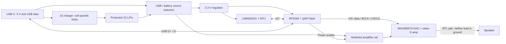

# Proposed architecture

Status: schematic integration draft, not frozen. The
[handbell derivative](../hardware/handbell/README.md) adapts Adafruit 5768 and
now has a native schematic/netlist with LSM6DSOX. Peripheral reduction,
cell/speaker choices and physical layout are still open.
All upstream implementation claims refer to the
[pinned source catalog](reference-designs.md), particularly the
[5768 schematic](https://github.com/adafruit/Adafruit-RP2040-Prop-Maker-Feather-PCB/blob/408fa9a40c0a01a3a65497ef42a29e0b08fe711e/Adafruit%20Feather%20RP2040%20Prop-Maker.sch).

This is a logical diagram, not wiring instructions. Protection, decoupling,
clocking, reset, USB CC terminations, test access, and control/status circuits
must be explicit in the schematic.

## 2026-09-07 sensor direction for the derivative

The owner approved [LSM6DSOX / Adafruit 4438](motion-sensing.md). The separate
draft implements regulated 3.3 V I2C at 0x6A, two local 100 nF bypass capacitors,
ST Mode 1 auxiliary-pin straps, INT1 on GPIO22 and INT2 at TP6 only.
It does not copy a second regulator or level shifter into this 3.3 V system.
The diagram describes that derivative; the table below records the unchanged
5768 baseline. LSM6DS3TR-C remains an alternative, not an imported source.

Bench comparison can retain the onboard LIS3DH at 0x18 and connect the external
LSM6DSOX at 0x6A on the same I2C bus. The
[pin/footprint and ERC records](../hardware/handbell/README.md) cover the
substitution; the Python initialization defect documented there is a bring-up
gate. Neither sensor directly proves physical chest contact.

## Verified 5768 baseline

| Block | Upstream implementation | Handbell implication |
|---|---|---|
| MCU | RP2040, 12 MHz crystal, external 8 MB QSPI flash | Preserve support circuitry and compatible flash; filesystem space is less than raw flash capacity |
| Audio | MAX98357A mono I2S DAC/class-D amp; default 9 dB gain | A separate DAC is redundant; channel and gain configuration need a deliberate choice |
| Sensor | LIS3DH at I2C address 0x18; INT1 wired | Three acceleration axes, no angular-rate measurement |
| Charger | MCP73831T-2ACI/OT; R8=5.1 kohm, about 196 mA nominal | Do not copy charge current until the actual cell is chosen |
| Input selection | Schottky D4 PMEG2020AEA and P-MOSFET Q3 DMG3415UFY feed `VHI` | Discrete USB/battery source selection, not an integrated current-budgeting PMIC |
| Logic rail | RT9080-3.3 from `VHI` | Regulator EN is not a complete battery disconnect |
| Peripheral rail | GPIO23 drives Q2/Q1 AO3401 switching `VHI` into `V+` | Supply switching is shared with removable peripherals; retain the amplifier's path |
| Amplifier enable | SD_MODE through R18=1 Mohm to switched `V+` | No independently wired MCU mute; an added control would be a design change |
| USB-C | USB data and separate 5.1 kohm CC1/CC2 pulldowns | 5 V sink/USB device, not USB-PD negotiation |

On battery, the amplifier receives approximately the selected battery rail,
not a boosted 5 V. At low state of charge, output headroom and regulator margin
must be assessed. A hardware undervoltage/protection strategy cannot be
replaced by an application-only battery warning.

The 5768 discrete source-selection circuit is more than charging-only:
USB supplies the system separately when present. Nevertheless, USB input
budget, amp peaks, thermal behavior, battery-less behavior, and charge
termination remain project-specific review items. Do not connect the amp
directly to VBAT and assume the MCU's load-sharing arrangement still covers it.

## GPIO contract to preserve initially

Source:
[CircuitPython pins.c](https://github.com/adafruit/circuitpython/blob/d897c15f24b2a6de6529f138aed4705327020dab/ports/raspberrypi/boards/adafruit_feather_rp2040_prop_maker/pins.c).

| Function | CircuitPython alias | RP2040 GPIO |
|---|---|---|
| I2S data | `I2S_DATA` | 16 |
| I2S bit clock | `I2S_BIT_CLOCK` | 17 |
| I2S word select | `I2S_WORD_SELECT` | 18 |
| Switched peripheral supply, active high | `EXTERNAL_POWER` | 23 |
| I2C SDA / SCL | `SDA` / `SCL` | 2 / 3 |
| Sensor INT1 (LIS3DH reference / LSM6DSOX draft) | `ACCELEROMETER_INTERRUPT` in stock board definition | 22 |
| Optional external button | `EXTERNAL_BUTTON` | 19 |
| Optional onboard boot button input | `BUTTON` / `BOOT` | 7 |
| Onboard status NeoPixel | `NEOPIXEL` | 4 |
| Red status LED | `LED` / `D13` | 13 |

GPIO17/18 satisfy CircuitPython's consecutive-clock-pin constraint for RP2040
PIO I2S. Retaining pin numbers alone does not make a custom board fully
compatible with the stock UF2: check core circuit, flash, clock, boot/reset,
USB identity, and reserved status pins. GPIO4 must not be casually reassigned
while using a build that treats it as its status NeoPixel.

## Reuse and reduction policy

| Keep initially | Candidate removal | Explicit new design decision |
|---|---|---|
| MCU core, clock, flash, USB and recovery access | Feather headers and unused breakout pads | Final connector/control set |
| I2S amp, gain/channel network, supply bypassing, relevant output network | Large speaker terminal block, replaced by selected keyed connector | Independent SD_MODE control; gain and digital limiting |
| Approved LSM6DSOX, INT1 and required I2C pullups | STEMMA connector and breakout-only regulator/level shifters where genuinely redundant | INT2 MCU route if needed; gesture configuration |
| Charger support and source-selection circuit | Duplicate USB connectors, charger circuits and regulators from combining breakouts | Cell protection, temperature sensing, current setting, input protection |
| Shared amplifier power switching and bias resistors | Servo header; external NeoPixel connector, level shifter and dedicated branch parts | Real off/sleep policy, battery sensing, status indication |

The integrated 5768 provides a servo connection, not a generic motor-driver
subsystem to remove wholesale. The older 3988's analog amp and RGB drivers are
different circuitry; do not merge those assumptions.

## Audio layout principles

I2S removes a vulnerable board-level analog input path, but it does not remove
switching-current, supply, and return-path concerns. Start with a continuous
ground reference; do **not** split "audio" and "digital" grounds by reflex.
Keep amp bypassing and switching loops short, route the BTL pair together, and
avoid narrow shared high-current paths under sensor/clock circuitry.

MAX98357A output terminals are both driven: neither is circuit ground, a
headphone ground, the metal bell, or a safe earth-referenced probe point.
Review output EMI components and cable length against the manufacturer
[layout guidance](https://cdn-shop.adafruit.com/product-files/3006/MAX98357A-MAX98357B.pdf).
An imported layout is evidence to inspect, not copper that can be rearranged
without revisiting current flow.
