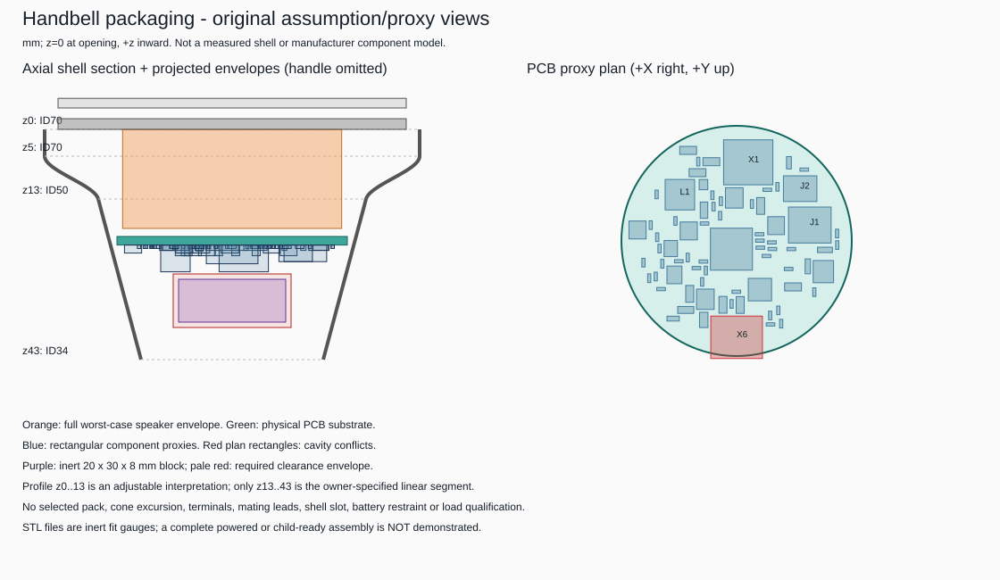

# FreeCAD mechanical feasibility

**September 11 update:** [new shell stations and owner clarifications](measurements/2026-09-11-shell-speaker-inputs.json)
supersede the old assumed taper for new work. The first concave section ends
at z14.90; the owner requests a uniform 1.15 mm working wall and now measures
the speaker magnet as D21.70. The
[T8 integration plan](t8-integration-plan.md) includes actual battery capture,
USB access and service attachment before routing. Preserve the old artifacts
and their original parameter/manifest bindings.

**Historical measurement follow-up, 2026-09-09:** the
[separate measured-speaker study](../mechanical/studies/2026-09-09-measured-speaker/README.md)
uses the owner's arrived-part measurements and captures physical print feedback.
The speaker is 40 mm OD and 19 mm deep, not the earlier 18.5 mm retail maximum.
Its measured basket rear is D32 at z12, followed by a D22 x H7 magnet.
The original artifacts and findings below are preserved as the September 7
snapshot, not silently regenerated. The new outward-facing screen does not yet
establish a complete fit or reinforced carrier.

**2026-09-07: actual editable CAD and fit-print artifacts, not a demonstrated
complete fit.** FreeCAD generated the
[native document](../mechanical/handbell-feasibility.FCStd),
[STEP assembly](../mechanical/handbell-assembly.step),
[carrier](../mechanical/fit-carrier.stl),
[separate interface](../mechanical/bonded-interface.stl) and
[grille](../mechanical/grille.stl). The current 74-component placement is integrated
as explicitly approximate solids, directly from the final supplied manifest
with **no height overrides**. J2 is the selected **SM02B side-entry at 3.1 mm**.
The study retains the required-but-unimplemented USB slot's raw interference
and insufficient clearance around the larger battery dummy. The earlier
height-screen J2/battery overlaps are no longer present. No routed board,
live-cell assembly, acoustic result or child-ready hardware is claimed.

**Print-now addition:** the [inert dummy set](../mechanical/README.md#print-now-inert-dummy-set)
includes standalone populated-PCBA STEP/STL, two full-cylinder speaker gauges,
an explicitly illustrative speaker STEP/STL, two battery blocks and two
clearance gauges. These are delivered files, not just modeling instructions.



## Installed toolchain and reproduction

Installed silently for the current Windows user with the official winget package:

```powershell
winget install --id FreeCAD.FreeCAD --exact --source winget --scope user --silent --accept-package-agreements --accept-source-agreements --disable-interactivity
```

The exercised version is **FreeCAD 1.1.3, revision 20260725 (Git shallow)**,
commit `145529fe741292ff0b3977a01195bf0247425794`, with **OpenCASCADE 7.8.1**
and bundled **Python 3.11.14**. Executable:
`%LOCALAPPDATA%\Programs\FreeCAD 1.1\bin\FreeCADCmd.exe`.
No prior installation was found. Winget verified the installer hash and
successfully installed the user-scoped package; no fallback installer was needed.

Official installer:
<https://github.com/FreeCAD/FreeCAD/releases/download/1.1.3/FreeCAD_1.1.3-Windows-x86_64-py311-installer.exe>

Installer SHA-256:
`3de56676dedb7c68f4da9734c79abeaff9bbbf09f6a2c01df72a82beeee81c11`.

From the repository root:

```powershell
$FreeCAD = "$env:LOCALAPPDATA\Programs\FreeCAD 1.1\bin\FreeCADCmd.exe"
& $FreeCAD --version
python .\tools\build_mechanical.py --freecad-cmd $FreeCAD --placement .\hardware\handbell\placement\placement-manifest.json
```

This is a console build: **no FreeCAD GUI was opened** and no KiCad window,
document or settings were changed. The launcher supplies isolated temporary
`--user-cfg` and `--system-cfg` files and runs synchronously. Exact executable
arguments, console bootstrap and output are written to local
`mechanical\freecad-build.log` on regeneration. This machine-local diagnostic
file is Git-ignored and is not part of the published download.
Actual native export operations are `doc.saveAs(...)`, `Part.export(assembly,
step_path)` and `MeshPart.meshFromShape(...).write(stl_path)` in the
[readable script](../tools/build_mechanical.py).

[`parameters.json`](../mechanical/parameters.json) and the native `Parameters`
spreadsheet expose dimensions. Edit a parameter JSON or saved spreadsheet and
regenerate with `--parameters` or `--parameters-from`; the
[mechanical README](../mechanical/README.md) contains those commands and native
viewing instructions. Spreadsheet edits alone do not recompute the generated
BReps. The FCStd includes source and input snapshots, with separate named solids,
not a mesh-only model or an undisclosed one-off construction.

### Final supplied manifest and connector configuration

The supplied manifest SHA-256 is
`bca8252da704c28e0982eacd353149119c557c5a6a1f0f5452f98bc73d00af41`.
It contains **74 fitted components, 18 copper-only reverse features and C29 DNP**.
J2 is **SM02B-SRSS-TB side-entry**, screened at **3.1 mm** from the reviewed JST
2.95 mm reference mated-height reading. Its local manifest envelope is
**4.8 x 6.25 x 3.1 mm**. The placement generator includes a 0.7 mm front mating planning
allowance; the model consumes the supplied final width/depth and center verbatim,
without adding another 0.7 mm to that proxy. No separate mating-allowance field
or qualified cable/plug/underside-anchor model is present in the manifest.

**D3 is 1.1 mm high and D4 is 1.0 mm high.** The final supplied footprint
identifiers, XY centers, dimensions and mathematical rotations are retained;
reverse-face copper and the DNP reservation do not create physical component
boxes. Native PCB net-associated copper and back-face semantics remain the
electrical handoff's scope, not an inference from these bounding-box solids.

The temporary J2 height override is removed. The earlier top-entry screen and
its battery-clearance overlaps are superseded; do not apply an override when
reproducing this final manifest. No placement input or electrical
file was modified. The hash above identifies the exact bytes consumed, including
embedded native-PCB hash metadata; later metadata-only updates can change the
manifest hash even when component geometry remains identical.

## Model evidence and exact profile

The opening is `z=0`, with positive z inward, in mm. This model **does not**
use the superseded hypothetical 40 mm-at-z22 station.

| Region/input | Implemented geometry and evidence |
|---|---|
| z=13..43 | Exactly `D(z) = 50 - (16/30)*(z-13)`; the owner's explicit working assumption, not a measured tolerance profile |
| z=0..5 | ID70 cylinder; interprets "almost flat for 5 mm" as **axial** travel with little diameter change |
| z=5..13 | Smooth monotone cubic transition from ID70 to ID50; adjustable approximation, not owner measurement or photo-derived dimensions |
| Shell exterior | Invented 0.7 mm radial wall and 1 mm crown closure at z43..44; visual context only |
| Handle | Owner's approximate 85 mm exterior height at z44..129; invented 16 mm diameter solid placeholder; **no usable handle interior assumed** |
| EK1794 speaker | Full D40.9 x H18.5 cylinder, front at z=0 by default; conservative retail-drawing maximum frame/depth envelope |
| Battery | Centered inert 20 x 30 x 8 block at z28..36; no selected pack, capacity, current or charge approval |

The curved radius uses cubic Hermite interpolation, or equivalently a cubic
Bezier in the radial/axial plane. It has dR/dz=0 at z5 and dR/dz=-8/30 at z13,
meeting the linear taper tangentially. With `t=(z-5)/8`:

```text
R(z) = (2*t^3-3*t^2+1)*35
     + (-2*t^3+3*t^2)*25
     + (t^3-t^2)*8*(-8/30)
```

The lip description could instead refer to radial flange width or another shape.
This interpretation is only a sensible initial screening approximation; it
cannot be claimed conservative relative to an unmeasured real shell. Measure
the transition, shell ovality, paint/wall thickness and residual clapper/handle
intrusions before treating any small clearance as usable.

The speaker drawing supplies frame 40.5 +/-0.4, depth 18 +/-0.5, magnet
22 +/-0.5 and rim 2.7 +/-0.3 mm. **The rim is included in overall depth.**
The magnet's 22.5 mm maximum is not used to carve away the unknown basket.
Terminals, wire exits, cone excursion and rear-vent space remain unknown.
The seller's **3 W title versus 2 W description is unresolved**.
No owner/vendor photo is redistributed or used to infer dimensions.

## Quantitative fit findings

Positive radial values below are geometric margin in the **assumed** cavity,
not allocated manufacturing tolerance, electrical insulation or carrier space.
All footprint/body proxies retain their source XY, width/depth and rotation.
All heights now use the final manifest values without overrides.
No geometry is silently shrunk, shifted or clipped to fit.

| Screen | Result |
|---|---|
| Full 40.9 x 18.5 speaker at z0 | Cavity ID at its rear is 47.067 mm; **3.083 mm radial margin**; no shell intersection for this cylinder |
| 43 mm substrate at z20..21.6 | Cavity ID at rear is **45.413 mm**, leaving **1.207 mm radial margin**; substrate-to-speaker axial gap is 1.5 mm |
| 43 mm board, inward components | 73 of 74 component proxies contained; **X6 USB intersects the uncut shell by about 2.911 mm3** |
| X6 USB envelope | x=-4.82..4.82, y=-21.965..-14.035, z=21.6..25.1; deepest-corner radial deficit **0.714 mm** |
| Closest non-USB component | X1, 5 mm height, ends at z26.6; approximately **1.310 mm radial margin** |
| J2 side-entry at 3.1 mm | Extends z21.6..24.7; **2.583 mm radial margin**, with no battery-clearance-envelope intersection |
| 43 mm board, outward components | **13 proxies intersect the speaker envelope**; 5 mm parts occupy z15..20, overlapping the speaker's rear by up to 3.5 mm |
| 40 mm board at z25..26.6, outward components | Substrate margin **1.373 mm**; the tallest 5 mm parts leave **1.5 mm** to the speaker; no speaker intersections, but USB still conflicts with shell |
| Same unchanged XY on that 40 mm disk | C26, Q2, X1 and X6 extend beyond the substrate outline; **not an approved 40 mm placement** |
| 40 mm board at z25..26.6, inward components | X1 and X6 conflict with the taper; moving everything inward is not a general fix |
| Nominal EK1725 seller-cylinder comparison | D50.8 x H30 at z0 has **4.933 mm radial deficit** at z30; actual basket dimensions must be measured before rejecting the real on-hand speaker |

At z26.6 the cavity ID is 42.747 mm. A hypothetical full-width 43 mm
component plate extending 5 mm above the z21.6 board surface would fail,
although individually inset real-placement proxies can fit. Component height
and radial location must therefore be considered together.

The 13 outward-face speaker conflicts are C1, C4, C5, C19, C20, C26, C27,
C28, J1, J2, L1, X1 and X6. The full speaker cylinder is deliberately
conservative; those are envelope conflicts, not proof that an unknown narrow
basket would collide with every one of those parts.

There are **zero unplanned component-cavity conflicts and zero component-pair
material intersections** in the primary scenario. X6 is classified separately
as `required_not_implemented` in `required_shell_cutouts`, not excused or cropped.
Its raw uncut-shell intersection remains in every applicable scenario and the
assembly report. Proxy bounds are not a USB-slot fabrication specification:
plug, cable, underside anchors, insulation and connector load path are unresolved.

### Battery clearance, without compression

The default 20 x 30 x 8 block occupies z28..36. Its farthest XY corner has
radius 18.028 mm, leaving **0.839 mm** at the deepest plane. That bare block
fits the assumed cavity, but this does **not** establish pack fit.

Adding an explicitly assumed **1 mm on every face** produces a 22 x 32 x 10
clearance envelope at z27..37. It has **0.816 mm radial deficit** and about
**2.968 mm3 outside the cavity**. Do not resolve this by squeezing a live pouch.
Its mouthward face at z27 is **0.4 mm beyond the tallest component proxies**;
there are no component intersections with this clearance envelope. J2 itself
ends at z24.7, leaving 2.3 mm to the clearance envelope. The shell conflict
remains unresolved. There is no tray, strain relief or qualified pack lead.

At the same z28 starting plane, an **18 x 28 x 8** dummy plus the same
clearance has **0.572 mm radial margin to the cavity**, and its clearance envelope
also has **no intersections with currently modeled material solids**.
This is a dimensional clearance result, not qualification of a real pack or
complete mating harness. A separate **18 x 28 x 8 at z28.5** depth-sensitivity
comparison also clears modeled solids with **0.439 mm radial cavity margin**.
Moving that variant inward is no longer necessary to avoid J2; it simply trades
axial room for reduced taper clearance. The default dummy in the primary
assembly is not moved or resized.

These are dimensional alternatives, not selected batteries or capacity/current
promises. A **20 x 30 x 6** dummy at z28 still fails shell clearance by
**0.283 mm**, but no longer intersects J2. Pack selection, swelling
allowance, protected leads, connector and independent restraint remain open.

## Removable-cartridge fit prints

### 2026-09-07: speaker-facing electronics and cylindrical-cell alternative

The owner clarified the intended orientation: **populated PCB face toward the
speaker/opening; battery on the opposite, handle-facing side**. The owner has
started printing the existing fit kit and explicitly calls this a thought
experiment. The released inward-component 0.2 models remain unchanged; this is
an alternative to investigate, not a claim that flipping the current placement
produces a complete fit.

The preferred battery attachment concept is PCB-mounted metal contacts plus an
original printed capture cradle, without a battery wire harness. **Through-hole
or SMT contacts are both acceptable.** A mechanically fixed commercial CR123A
holder is a comparison option, not a selected part. Optimize complete assembly
cost, insertion/retention and occupied volume rather than contact style alone.

#### Cell-only screen

A cell lying across the PCB is more plausible than one pointing along the bell
axis. As a concrete size example, [KeepPower's protected RCR123A 800 mAh page](https://www.keeppower.com.cn/products_detail.php?id=635)
specifies a maximum 16.8 mm diameter and 34 mm length, 3.7 V nominal and 4.2 V
maximum. This does not establish its discharge capability for the handbell or
select that SKU; protected/button-top dimensions vary by product.

With the substrate unchanged at z20..21.6, assume the bottom of a centered,
horizontal cell is at z22.6, leaving an illustrative 1 mm above the
handle-facing board surface:

| Bare envelope in otherwise empty handle-side space | Analytic cavity screen |
|---|---|
| Diameter 16.8 x length 34 mm | Top at z39.4; approximately 0.575 mm minimum radial shell margin |
| Nominal diameter 18 x length 35 mm | Top at z40.6; approximately 0.325 mm radial interference before button/protection additions or mounting hardware |

These calculations use the existing assumed linear taper, not a new FreeCAD
assembly or measured fit. For cell half-length `a`, radius `r`, center depth
`zc`, and taper slope `k=8/30`, the minimum radial margin for these two
centered cylinders is:

```text
R(zc) - sqrt(1+k*k) * sqrt(a*a+r*r)
R(z) = 25 - (8/30)*(z-13)
```

The limiting slice is within each cylinder's height. Contacts, cradle, shell
variation, assembly clearance, insulation and the terminal/button details are
not included. The small positive 16340 result is therefore a reason to study
the alternative, not usable tolerance already allocated to a holder.

#### What must change or be established

The existing outward-face screen has 13 component overlaps with the full
speaker cylinder. A real, narrower basket/magnet may leave useful peripheral
space, but its undimensioned profile must not be treated as empty. Measure the
actual speaker, terminals, vent and excursion; then repartition the tall parts
and preserve electrical placement constraints. Moving the board toward the
handle to clear the speaker sacrifices the cell's taper clearance. Do not just
flip the current board and declare those conflicts resolved.

The printed cradle/cover must carry cell inertia and insertion loads through
supported mechanical attachments, with positive axial and radial capture.
Spring contacts provide electrical contact pressure; their solder joints must
not be the sole restraint in a shaken instrument. Include an insulating
barrier/keepout and protect the cell wrapper from edges. Solder mask alone is
not a qualified barrier against the metal cell can. Do not locate attachment
loads through the IMU or thermally sensitive power area.

Through-hole contacts would usually be inserted from the battery side and
soldered on the populated, speaker-facing side: their holes, pads and trimmed
tails consume speaker clearance and routing/return-plane space. SMT contacts
on the battery side avoid through-hole tails but add reverse-face assembly
operations or manual attachment; they do not retain the "all fitted parts on
one face" assumption. Compare actual part drawings, insertion force, current,
contact resistance, plating, solder process and complete assembly cost. No
specific contact/holder footprint or price is qualified in this follow-up.

Electrical adoption requires cell-specific current/charge limits, reverse
insertion protection, contact-bounce/brownout review and a revised schematic/BOM.
A removable cell's protection circuit is not automatically protection against
reverse insertion into the instrument. A CR123A-shaped holder does not establish
compatibility with a protected 16340's dimensions or authorize charging a
disposable CR123A or 3.2 V LiFePO4 cell. Use an approved 4.2 V-charge Li-ion cell,
clear compartment identification and controlled access suitable for the
eventual educational product; the fit prints are not that safety design.

Commercial contacts can be used with original cradle geometry. If adapting a
3D-print repository design instead, inspect its actual license and preserve
attribution before copying; a downloadable STL is not automatically open for
every use. No third-party holder CAD has been imported.

Owning epics: [E04/#4](https://github.com/dcuccia/digital-handbell/issues/4),
[E05/#5](https://github.com/dcuccia/digital-handbell/issues/5) and
[E07/#7](https://github.com/dcuccia/digital-handbell/issues/7).

### Existing fit-print geometry

The physical study separates a mounting interface, removable carrier/baffle and
grille. It is intended to explore preassembly outside the bell rather than
permanently bonding the entire electronics/battery stack into the shell.

| Part/feature | Default geometry and limitation |
|---|---|
| Bonded interface | OD69, ID56, z0..3; 0.5 mm nominal radial gap to the assumed lip, not an adhesive specification |
| Carrier/baffle | Nominal 65 mm baffle, 38 mm assumed sound aperture, 2 mm thick; locating sleeve ID41.5 with 1.5 mm wall, z0..3 |
| PCB seating rails | Three tapered 1.2 x 2.5 mm rails at 0/120/240 degrees, seating plane z20; 0.6 mm under-edge seating tabs |
| Rail-to-shell allowance | Only approximately **0.199 mm at the rail top outer corner**, before print/shell tolerances or insulation |
| Grille | OD65 x 1.8 thick, z=-5.8..-4; assumed 4 mm to speaker front, not a cone-excursion qualification |
| Grille openings | 2.8 mm slots on 4 mm pitch, about 789.092 mm2 open area / **69.58% of the 38 mm aperture**, not of the entire grille disk |
| Mating alignment | Three 2.4 mm through holes at radius30.5; no threads, inserts, screw lengths, torque or captive-hardware scheme qualified |

The carrier's grille bosses extend its total X envelope to **65.6 mm**;
its BRep bounds are 65.6 x 65.0 x 24.0 mm. It is a single connected solid,
not disconnected pads represented as one STL. The three printed parts have no
positive material overlap with one another, the speaker or board in the primary
assumed study; their seating contacts have zero volume.

**These are fit gauges, not completed structural retention.** The sleeve only
locates the speaker; the PCB rests on tabs without a positive clamp. There is no
battery tray/restraint, speaker clamp, rated adhesive bond or qualified USB load
path. Do not shake a loaded mock-up, glue in a live cell, assume a metal-shell USB
slot is safe, or distribute these parts as child-ready hardware. Actual retention
requires measurements, insulating/deburred access, supported connector anchors,
captive fasteners, strain relief and physical testing.

## Printable populated PCBA and inert dummies

[`populated-pcba-proxy.step`](../mechanical/populated-pcba-proxy.step) and
[`populated-pcba-proxy.stl`](../mechanical/populated-pcba-proxy.stl) contain
**one connected solid**: the 1.6 mm substrate fused to all 74 supplied boxes,
without changing their widths, depths, heights or poses. Overall print bounds
are **43 x 43.465 x 6.6 mm**; the extra Y extent is the USB proxy, not an
enlarged PCB. No 0402 details were exaggerated and no disconnected component
was joined with an invented external bridge. This is a fake populated-board
envelope, not actual manufacturer bodies, PCB artwork or an electrical assembly.

The new PCBA print/STEP has its substrate underside at **Z=0** and components
upward; translate it +20 mm in z to recover the current assembly placement.
The native document retains separate source component solids and a standalone
`FitDummies` group. Hide that group when inspecting the assembly. The 82-solid
assembly STEP does not include duplicate print dummies.

The nominal and maximum speaker STL gauges are full **D40.5 x H18** and
**D40.9 x H18.5** cylinders. The independently generated
[`speaker-illustrative-unmeasured.step`](../mechanical/speaker-illustrative-unmeasured.step)
and matching STL use the nominal frame, depth, 2.7 mm rim and 22 mm magnet
diameter, but a **37-to-26 mm solid basket taper** and **magnet starting at z12**
are unmeasured adjustable assumptions. The resulting magnet height is 6 mm;
the basket is 9.3 mm high. These intermediate dimensions were not measured from
the image. The image is not copied into any output. The illustrative shape
never replaces the full maximum cylinder in interference calculations.

Separate battery dummies are **20 x 30 x 8** and **18 x 28 x 8 mm**; their
solid clearance gauges are **22 x 32 x 10** and **20 x 30 x 10 mm**, respectively.
All new standalone STL/STEP dummies start at print Z=0. Restore core-block
bottoms to assembly z28 and clearance-gauge bottoms to z27 when comparing the
current study. The larger clearance gauge is expected to fail the assumed
cavity; passing the bare block is not sufficient reason to choose a live pack.

The [print inventory](../mechanical/fit-dummies.json), [original dummy view](../mechanical/views/fit-dummies.svg)
and [K1C/PLA guidance](../mechanical/README.md#creality-k1c--pla-starting-guidance)
record sizes, orientations and limitations. Print at **100% in mm**, using the
profile for the installed nozzle and PLA. Inspect fine features and USB overhang,
measure the cooled prints, and never treat PLA as a qualified thermal material,
live-battery restraint, functional PCBA or child-ready assembly. No slicing,
G-code, physical print or live-hardware qualification is claimed.

**Logical stopping point:** the editable model and inert print set are ready
for physical comparison while awaiting the real speakers. The next mechanical
evidence is measured shell/driver geometry and fit observations, not further
installer work. This is **not routing approval**: see the separate
[routing-readiness handoff](routing-readiness.md) for the electrical and native
PCB gates. Required USB access,
real harness/anchor envelopes, cell selection and load/retention qualification
remain unresolved.

## Manifest handoff and artifact integrity

**Integration is complete for the currently available manifest**, not deferred
until another tool installation. It contains 74 components and was supplied at
`hardware\handbell\placement\placement-manifest.json`. The consumed file hash is
recorded in `fit-report.json`, alongside the source-script hash. Later placement
or height updates require one regeneration with `--placement`; no KiCad export
or manual 3D placement step is required. Real manufacturer bodies can be added
later only with suitable dimensions, orientation, licensing and provenance.

The implemented contract is schema version1, units `mm`, board keys
`diameter_mm`, `thickness_mm`, `front_z_mm`, `component_face`, and component keys
`reference`, `x_mm`, `y_mm`, `width_mm`, `depth_mm`, `height_mm`, `rotation_deg`,
`footprint`, `height_source`. XY is the local envelope center relative to board
center; rotation is the supplied conventional mathematical angle about +Z.
It is already the negative of the KiCad angle; **do not negate it again**.
Substrate is always front_z through
front_z+thickness. Inward component base is front_z+thickness and grows toward
+z; outward components end at front_z and extend toward -z.

The `requires_shell_cutout` annotation is preserved but **does not waive a
collision**. Required slots are classified explicitly while raw interference is
retained. Copper-only reverse features and the DNP reservation are recorded
separately and do not create zero-height component solids. Extra source metadata
remains in the native input snapshot. The input hash is computed from the exact
bytes parsed for the build, not from a later reread during concurrent parent work.
Missing requested files, invalid units, duplicate references, non-finite numbers
and non-positive body dimensions are rejected. No manifest means an explicitly
labelled placeholder-only result, not an apparently populated success.

The generated report records BRep validity, positive closed solids and exact
material intersection volumes. STEP was reimported with **82 solids**, explicit
mm units and unchanged assembly bounds **71.4 x 71.4 x 134.8 mm**, including the
placeholder handle and outward grille. FCStd was reopened and its saved shape
volumes, parameters and source snapshot inspected.

All **eleven STLs** were reimported as single closed, manifold,
non-self-intersecting meshes and converted back to valid closed BRep solids.
Both new standalone STEP files reimport as one solid, with mm units and matching
bounds. With 0.05 mm linear and 0.15 rad angular tessellation controls,
maximum STL volume deviation is below **0.18%** (the illustrative speaker) and
maximum coordinate-bound deviation below **0.000002 mm** in this run. These
are digital export results, not printer accuracy claims. STL requires explicit
mm import; no slicer settings or printing process were assumed.

Scope is confined to the new `mechanical` directory, new
`tools\build_mechanical.py` and this new document. Existing input JSON, shared
validators, KiCad files and git state were not edited. Original-mechanical and
electronics-context licensing are distinguished in the
[mechanical license declaration](../mechanical/README.md#attribution-and-license-boundaries).
