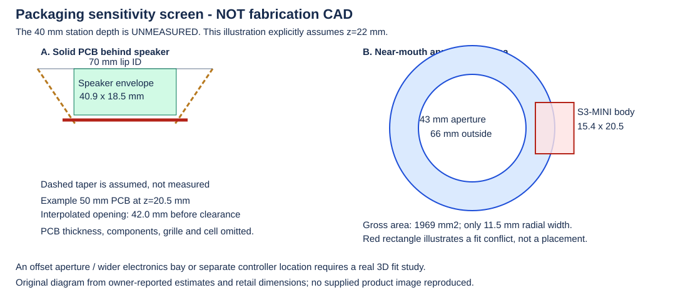

# Mechanics, acoustics, and manufacturing

Status: trade study and measurement plan, updated 2026-09-09. The owner has
shells, 2-inch speakers and the arrived EK1794. Its reported measurements are
D40/H19, a D32 basket rear at z12 and D22/H7 magnet; see the
[measured-speaker study](../mechanical/studies/2026-09-09-measured-speaker/README.md).
No cell, final PCB outline, assembly quote or production process is selected.

## Measure before choosing a circle

**Current feasibility model:** the owner now assumes D50 at z13 tapering
linearly to D34 at z43. The [FreeCAD study](mechanical-feasibility.md) and
[43 mm placement](electrical-reduction-and-placement.md) use that profile.
The z22 calculation below is preserved as a **superseded sensitivity example**,
not the current fit model. Real-shell tolerances, clapper intrusion, USB slot,
cell and mating harnesses remain measurement gates.

The initial [inspiration listing](https://www.amazon.com/Colorful-Handbells-Musical-Instrument-Wedding/dp/B09P4NTLWK)
did not establish usable internal geometry. The owner actually has
[B01EABRWO6 shells](https://www.amazon.com/dp/B01EABRWO6). Owner estimates and
the supplied retail speaker dimensions are captured in
[structured inputs](measurements/shell-speaker-inputs.json); do not substitute
external photographs for inner taper, handle/clapper intrusion and tolerances.

| Owner-reported shell input | Approximate value / limitation |
|---|---|
| Inside diameter just inside lip | 70 mm |
| Inside diameter halfway down the smaller tapered region | 40 mm; depth from lip not specified |
| Bell-body height | 44 mm |
| Handle height | 85 mm; hollow/usable interior not established |

Use the lip plane as axial datum `z=0`, positive inward. Record clear ID at
known depths (for example every 5 mm), including ovality and the minimum usable
diameter after the clapper is removed. Identify the existing 40 mm station.
Measure the candidate USB opening at its proposed depth, not just at the lip.

Measure several shells, ideally across more than one set. Record inner diameter
at multiple heights, ovality, wall thickness, lip profile, depth, handle/clapper
mount, usable USB-slot locations, and total mass. Keep a drawing with a datum and
measurement uncertainty. Clarify how removing the clapper changes the shell.

For each real speaker and cell, record the full envelope, frame/ear dimensions,
connector/cable exit, magnet/back-vent keepouts, mounting surfaces, and mass.
Stack up the diaphragm/grille clearance, speaker depth, rear acoustic cavity,
PCB standoffs, components on both faces if any, battery, insulation, screw ends,
and assembly/tool access.

Begin with cardboard circles and an inert battery-sized block, then a simple
printed carrier. Do not test fit by compressing a live pouch cell.

## Why the axial stack now matters

The historical 40 mm speaker drawing's worst-case frame diameter is **40.9 mm**, magnet
diameter **22.5 mm**, and overall depth **18.5 mm**. Its rim dimension is included
in that height. The basket profile, terminals, rear vent and excursion envelope
are not fully established. Those are retailer dimensions, not the current
arrived-part measurements: the owner's reported **19 mm** depth exceeds the
old 18.5 mm gauge. Keep the following calculation as historical sensitivity
analysis; use the new study for current station-based geometry.

For a **sensitivity example only**, assume the 40 mm shell ID occurs 22 mm
inward and a straight taper connects it to the 70 mm lip:

```text
ID(z) = 70 - (30/22)*z, for 0 <= z <= 22 mm
```

At 18.5 mm depth this hypothetical cavity is 44.8 mm wide. Add an illustrative
2 mm gap behind the speaker and the PCB plane sees only **42.0 mm** before
board thickness, component height, carrier, battery or other clearances.
Under that assumption, 55/50/45 mm PCB planes must be no deeper than
11.0/14.7/18.3 mm, respectively. The owner did **not** measure the 40 mm station
at 22 mm; these numbers are not a fit finding or a profile extrapolation.



The original diagram and [numeric screen](measurements/packaging-screen.json)
are generated with standard-library Python:

```powershell
python .\tools\screen_packaging.py --assumed-40mm-depth 22
```

The required argument makes the invented station explicit. The
[input record](measurements/shell-speaker-inputs.json) still stores its actual
depth as `null`. No supplied product photo/drawing is redistributed.

Study a **near-mouth annular/C-shaped or offset board** rather than forcing all
electronics onto a disk behind the magnet:

| Hypothetical outer / inner diameter | Gross annulus area | Area after 1 mm excluded at both edges | Radial width |
|---|---:|---:|---:|
| 64 / 43 mm | 1,765 mm^2 | 1,429 mm^2 | 10.5 mm |
| 66 / 43 mm | 1,969 mm^2 | 1,627 mm^2 | 11.5 mm |
| 68 / 43 mm | 2,180 mm^2 | 1,831 mm^2 | 12.5 mm |

The 66/43 example has the gross area of a 50.1 mm solid disk, but its narrow
band is harder to place/route. **A 15.4 mm-wide S3-MINI body does not fit wholly
in this uniform band**; it needs a wider bay, offset aperture, permitted
overhang with real 3D clearance, or another location. Antenna keepouts are extra.
These examples are not selected outlines and do not prove that the battery,
USB or power block fits.

Component height near the tapered wall matters even when the PCB plane fits.
A shallow printed mouth extension, or components facing outward toward a
standoff grille, may create room. Model USB access and antenna placement with
that choice; neither a printed bezel nor an open mouth guarantees usable RF.
Do not block speaker vents or assume the smaller magnet diameter describes
the entire basket.

## One face, two layers, and board-area estimates

**One-sided assembly** means components placed on one PCB face. **Two-layer**
means two copper layers. These are different constraints.

The KB2040 provides a relevant two-layer RP2040 precedent. QT Py RP2040's
compactness also uses bottom-side components, so its dimensions do not prove
our one-face target. Connectors, power/thermal copper, test access, routing,
and mechanical keepouts may dominate the silicon area.

Use actual component courtyards for a first screening estimate:

```text
D_estimate >= 2*m + sqrt((4/pi) * (A_K + A_F/eta))
```

`A_F` is summed footprint/courtyard area; `A_K` is additional non-overlapping
reserved area; `eta` accounts for imperfect packing/routing; `m` is a radial
edge allowance. Values such as 0.45-0.65 for `eta` are only sensitivity-study
assumptions, not a design rule or demonstrated fit.

| Illustrative circle diameter | Gross circular area |
|---|---:|
| 40 mm | 1,257 mm^2 |
| 50 mm | 1,963 mm^2 |
| 60 mm | 2,827 mm^2 |

These are mathematical examples, **not recommended board sizes**. Fixed USB
orientation, fasteners, fragmented keepouts, taper, and height can defeat an
area-based result. Establish feasibility with actual placement and routing.

Compare one two-layer board against one four-layer board and two stacked
boards using the same BOM/envelope assumptions. Stacking adds interconnects,
supports, height, assembly steps, and failure points; it does not automatically
save cost. Four layers may be cheaper overall than a difficult two-board build.

## Speaker trade-space examples

These are comparison candidates, not an approved procurement list. Manufacturer
power ratings use different conditions and are not direct loudness comparisons.

| Example | Stated envelope / mass | Electrical rating | Use in the trade study |
|---|---|---|---|
| [Gikfun 40 mm, owner candidate EK1794](https://gikfun.com/products/gikfun-4ohm-40mm-diameter-3w-full-range-audio-speaker-stereo-woofer-loudspeaker-for-arduino-pack-of-2pcs) | Owner measured D40/H19, basket rear D32 at z12 and magnet D22/H7 on September 9; no tolerance limits established | Seller 4 ohm; **3 W title versus 2 W input-power rating in description** | Arrived and dimensioned at key stations; no assumed continuous/peak interpretation; qualify intended signal and limits |
| [Gikfun 2-inch, owner part EK1725](https://gikfun.com/products/gikfun-2-4ohm-3w-full-range-audio-speaker-stereo-woofer-loudspeaker-for-arduino-pack-of-2pcs) | Seller says 2-inch diameter, 30 mm height; measure the two on-hand units | Seller says 3 W, 4 ohm | Immediate acoustic comparison; substantially deeper nominal envelope |
| [Adafruit 1890](https://www.adafruit.com/product/1890) | 28 mm diameter x 4.5 mm; listing says 6 g | 8 ohm; datasheet 0.25 W continuous, 0.5 W short-term max | Very shallow/light baseline; enforce a suitable output limit |
| [Same Sky CMS-28468N](https://www.sameskydevices.com/product/product-resources/cms-28468n.pdf) | 28 mm diameter x 4.6 mm; 5.3 g | 8 ohm; 0.5 W nominal, 1 W max under stated test | Shallow, manufacturer-documented alternative |
| [Visaton BF 37, 8 ohm](https://www.visaton.de/en/products/drivers/fullrange-systems/bf-37-8-ohm) | 41 mm max frame extent, 37 mm across flats; 23.8 mm total depth; 33.1 g | 8 ohm; 5 W rated | Deeper/heavier comparison, not proof of fit or superior sound in this cavity |
| [Dayton ND65-4](https://www.daytonaudio.com/product/63/nd65-4-2-1-2-aluminum-cone-full-range-driver-4-ohm) | Listing approximately 64 mm diameter x 48 mm depth; confirm mechanical drawing | 4 ohm; 15 W RMS; specified 3.5 mm Xmax | Large long-excursion reference; may be impractical for this shell and amp |

Primary drawings:
[1890](https://cdn-shop.adafruit.com/datasheets/1890_8ohmMetalSpeaks.pdf),
[BF37](https://www.visaton.de/sites/default/files/dd_product/BF37-4-8-Ohm_datasheet_1.pdf),
[ND65](https://www.daytonaudio.com/images/resources/290-204-dayton-audio-nd65-4-specifications.pdf).
Do not confuse the BF37's stated mechanical excursion with linear Xmax.

Compare sensitivity, response, distortion, perceived timbre, mass, and current
at matched listening level. A deeper driver or higher wattage rating is not
automatically louder or better. The board, carrier, and battery reduce rear
volume and can obstruct vents. Establish front/rear acoustic separation where
intended; compare sealed, vented, and leaky mock-ups rather than assuming the
metal bell is a suitable speaker enclosure.
See [miniature-speaker enclosure guidance](https://www.sameskydevices.com/blog/the-critical-role-of-rear-enclosures-in-miniature-speakers).

## Retention and assembly concepts

Retain all three ideas in the [brief](project-brief.md). The current leading
concept is a **printed, removable cartridge and grille**, preassembled outside
the bell. A separately bonded mounting ring or interface retains it inside the
shell; do not permanently glue the battery into an inaccessible assembly.
Use printed baffle/speaker seats, independent cell retention and PCB supports.
Grille open area, stiffness, print orientation, cone clearance and rattle
behavior need physical evaluation. Prototype with inert fit pieces first.

USB insertion, removal, and cable-lever loads should transfer from connector
shell anchors through nearby PCB/carrier supports into the enclosure. Signal
pads and a far-side SMT threaded receptacle alone are not a demonstrated load
path. For scale only, the [GCT USB4105 drawing](https://gct.co/files/drawings/USB4105.pdf)
specifies 5-20 N mating force; that is not our structural acceptance criterion.

An SMT right-angle nut requires exact part selection and assembler approval:
packaging, pickup surface, reflow tolerance, solder joint strength, screw
direction, torque, and access all matter. Compare a captive nut or heat-set
insert in the carrier. Deburr and insulate any metal-shell slot. Mechanical
insulation is not galvanic USB isolation.

Define speaker-JST family and polarity explicitly; "JST" is not a connector
specification. The BFF's small speaker connector is PicoBlade-compatible, not
automatically the same family as a LiPo JST-PH. Avoid interchangeable battery
and speaker plugs or make misconnection impossible. Check actual retention
under shaking and access at every assembly step.

Use positive screw-length stops, captive hardware, strain relief, and
cell-manufacturer-required expansion/clearance. Keep cells away from sharp
edges, screw tips, heat, hard compression, and metal shorts. Printed carrier
adhesion to painted metal, print creep, and repair access need evidence.

## JLCPCB: fabrication plus optional assembly

Consult the current
[assembly capabilities](https://jlcpcb.com/capabilities/pcb-assembly-capabilities),
[PCB capabilities](https://jlcpcb.com/capabilities/pcb-capabilities), and
[assembly FAQs](https://jlcpcb.com/help/article/pcb-assembly-faqs)
when quoting; the following is a 2026-09-06 research snapshot, not order approval.

**2026-09-07 sensor update:** the inspected JLC listings for the owner-approved
LSM6DSOX and alternate LSM6DS3TR-C were Standard-only/Extended with required
X-ray inspection. Requote the entire BOM rather than assuming Economic assembly
from the one-face layout goal. See the dated [motion/sourcing report](motion-sensing.md).

| Topic | Planning consequence |
|---|---|
| Economic vs Standard | Economic advertises single-side placement on 2/4/6-layer boards; Standard supports single/double-side. Select the service from the complete job, not layer count alone. |
| Minimum sizes | Assembly and panelization limits are distinct. The inspected page lists Economic 10 x 10 mm and Standard 70 x 70 mm minima; small Standard boards may require an approved panel. Circular "Panel by JLCPCB" has a separate 20 x 20 mm minimum. Reconfirm during quotation. |
| Round outline | Routed tabs/mouse bites and a carrier can support handling; straight V-cuts cannot follow a circle. Reserve depanelization clearance and address residual tab roughness. |
| Rails/fiducials | Standard specifies rails/fiducials; the guide gives at least 5 mm rails. Economic rules differ. Obtain the actual panel acceptance. |
| USB-C overhang | Review connector body, stakes/slots, board edge, rails, and assembly access explicitly; a copper-edge rule is not permission for arbitrary component overhang. |
| Fine pitch | Economic lists 0402 minimum packages under supported conditions. Prefer factory assembly of fine-pitch ICs rather than requiring novice reflow. |
| Parts | Basic/Extended/Preferred Extended status changes setup charges; catalog/LCSC presence is not a guaranteed assembled part reservation. |
| Odd mechanics | SMT threaded hardware or unusual connectors may require custom/manual operations and a separate quote. |

On 2026-09-07 the rendered official capability table again confirmed
**Economic: single-sided placement; Standard: single- and double-sided**.
It lists 0402 / 0201 minimum packages respectively and X-ray for specified parts
in both services; not every QFN/LGA automatically requires Standard.
One-face remains the preference, not a guarantee of Economic eligibility.
If two faces win the trade study, factory assembly is preferable to assuming
novice backside inductor rework. Many small molded inductors have bottom
terminations, and moving the inductor alone can enlarge critical switching
loops. Treat IC, inductor, input/output capacitors and return paths as a block.

Additional official guidance:
[panelization](https://jlcpcb.com/help/article/pcb-panelization),
[rails/fiducials](https://jlcpcb.com/help/article/how-to-add-edge-rails-fiducials-for-pcb-assembly-order),
[assembly edge FAQ](https://jlcpcb.com/help/article/pcb-assembly-faqs-part-2),
[parts consignment](https://jlcpcb.com/help/article/how-to-consign-parts-to-jlcpcb).
Consignment is available but may introduce logistics overhead unsuitable for a
small initial batch; prefer supported stocked parts when technically suitable.

The [official KiCad BOM/CPL guide](https://jlcpcb.com/help/article/how-to-generate-the-bom-and-centroid-file-from-kicad)
describes BOM fields including `Comment`, `Designator`, `Footprint`, and supplier
part number, and CPL fields `Designator`, `Mid X`, `Mid Y`, `Rotation`, `Layer`.
Supply Gerbers/drills, BOM, and centroid data; inspect every placement/polarity
in the assembly preview. Match component substitutions to electrical, package,
and firmware requirements.

## OSH Park: bare-board comparison

[OSH Park](https://oshpark.com/) offers PCB fabrication, not a turnkey populated
board service. Budget separate component assembly; JLCPCB's FAQ says it does
not assemble externally fabricated PCBs.

At the research snapshot, standard
[two-layer](https://docs.oshpark.com/services/two-layer/) and
[four-layer](https://docs.oshpark.com/services/four-layer/) services list
$5/in^2 and $10/in^2 respectively, including three copies. These are published
service formulas, not a quote including components, shipping, or assembly.
Both list nominal 1.6 mm construction and ENIG; stackups and rules differ.
Two-layer lists 6/6 mil trace/space and 15 mil copper-edge clearance.

Round boards are supported, but
[billing uses the enclosing rectangle](https://docs.oshpark.com/submitting-orders/board-outline/):
for diameter D, billed area is D^2, not pi*D^2/4.
Choose whether a shared layout meets both vendors' rules or maintain explicitly
versioned fabrication variants. Revalidate the actual stackup and USB geometry
for the selected service.

## Total-cost model

Quote illustrative batches of 5, 25, and 100 instruments unless actual demand
sets different quantities. These are planning scenarios, not commitments.
Include PCB/panel waste, parts, extended-part setup, assembly, programming/test,
cell, speaker, bell shell, connectors/harnesses, printed carrier, fasteners,
shipping/taxes, yield, repair spares, and remaining manual labor.

Compare per-instrument and per-class-set cost and assembly time. Do not order
parts or fabrication without explicit owner approval.
