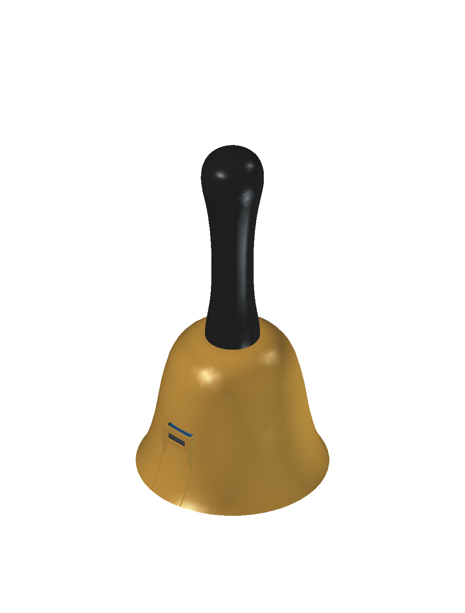

# Printed bell and front-face electronics revision

**September 13 owner-authorized engineering work.** The successful T8 fit
assembly at `fefa8bce4e02f1c6c216f7053fb5d7abb16f3d44` remains preserved.
The [dated design inputs](design-inputs/2026-09-13-printed-bell.json) distinguish
owner requests, working CAD selections and unclosed qualification gates.

## Approved direction

Use a single-piece, original printed bell shell around a removable cartridge
with a flush or recessed grille. Retain the successful speaker/yoke/PCB/cell
interfaces where practical. A separate black printed handle is the first
implementation, with a common attachment concept for a later wooden handle.
Do not include a broad handguard disk.

The supplied photographs guide only the generic flared handbell character.
They are not dimensional evidence, traced profiles or licensed assets for
redistribution. Neither image nor its artwork is imported into this project.

The owner is interested in ERYONE silk PLA and is willing to trade print time
for fine layers and exterior finish. Material processing guidance must retain
its source and scope; appearance is not structural or thermal qualification.
The [material and handle source notes](printed-bell-material-and-handle.md)
record the manufacturer's actual ranges, TDS limitations and working M4
fastener dimensions.

## Shared mechanical/electrical interface

The new z0 is the external grille/mouth plane. Initially keep the existing
speaker-relative stack: speaker front z4.5, magnet rear z23.5, PCB F z25.0
and PCB B z26.6. The cell centre remains z36.38, reflecting the nominal
9.78 mm contact datum above B. Removing the old cradle floor alone does not
change the metal contact's working height.

Try the 43 mm PCB first and retain the two existing M2 mounting holes.
Any enlargement must be supported by a coherent electrical floorplan and
reported against the original maximum outer envelope. The custom shell is
not a reason to make every part larger.

Consolidate the electronic SMT population on the speaker-facing side where
possible. The two B-side Keystone SMT contacts remain fitted components and
assembly work; this must not be advertised as a single-side reflow BOM without
an explicit contact-attachment process.

This is an assembly-flexibility improvement, not a guaranteed JLCPCB Economic
qualification. The [September 9 supplier review](electromechanical-wing-iteration.md#assembly-cost-is-a-decision-gate-not-a-reason-to-stop-drafting)
found an explicit Standard-only listing for the selected LSM6DSOX, independent
of placement face. Obtain a current whole-BOM/process determination rather
than silently deleting rear contacts from the master BOM or asking a novice
to fit the fine-pitch IMU. Compare factory-complete assembly with an explicitly
quoted secondary contact-attachment process. Two copper layers remain a
separate decision from one-face electronic SMT population.

A central M4 machine screw, broad washer and captive metal nut is the working
printed-handle selection. It is similar in size class to an 8-32 screw but not
thread-compatible. Use a keyed locating shoulder and a shell load path clear
of the battery. A wood-screw option is not qualified by a printed nut pocket.

## Completion sequence

1. Produce a separate native front-electronics placement and exact interface.
2. Bind a new FreeCAD shell, cartridge and handle to that interface, including
   both installed and service/plug paths.
3. Once those interfaces are stable, begin justified critical PCB routing.
   Preserve any unresolved native findings and electrical limits.
4. Publish native models, original rendered views, inert print files, a
   reproducible handoff and linked epic updates.

Final placement and routing status, dimensions, screw engagement and measured
or modeled findings will be recorded below when available. No fabrication,
live-cell or child-use approval follows from this engineering iteration.

## Delivered electrical stage 1

The [separate native placement](../hardware/handbell/iterations/printed-bell-front/README.md)
retains the **43 mm main PCB body**, its exact contact tabs/USB tongue, original
two M2 mounting holes and the initial USB datum. It now has **81 fitted
electronic parts on F and only two battery contacts on B**, with the unchanged
83-part T8 circuit and all 325 physical pad records preserved.

The RP2040 supply/crystal/flash, boost, amplifier and protection groups are
electrically floorplanned rather than merely repacked by body area. The native
package records actual pad distances, source guidance and remaining copper
layout requirements. Its fixed interface has been handed to the mechanical
consumer. The stage-1 manifest SHA-256 is:

`710717186d5ecc795edaf3da7eec8f6532f34077906645a8fca32318320f23c4`

Stage 1 is deliberately **unrouted**. ERC is zero; the four original USB
hole-clearance findings remain alongside unfinished silkscreen/text and
unconnected-net findings. No inherited GUI parity approval is transferred.
Routing waits for the complete mechanical interface review, not merely this
placement result.

## Printed shell, cartridge and handle

The [complete mechanical package](../mechanical/studies/2026-09-13-printed-bell/README.md)
now contains the actual all-front placement, an original one-piece bell,
flush removable grille/cartridge, retained battery capture and separate keyed
black handle. The PCB-related interface review supports beginning critical
routing. The initial release evidence is preserved in commit
`6e7ef9ef4dd1f6611695e73227630fdc5c8dae7a`; subsequent exterior refinements
do not move the board, its mounting holes, USB or contacts.



[Profile](../mechanical/studies/2026-09-13-printed-bell/views/profile.png) |
[Flush grille](../mechanical/studies/2026-09-13-printed-bell/views/grille.png) |
[Display-only cutaway](../mechanical/studies/2026-09-13-printed-bell/views/cutaway.png)

These are original CAD views, not photos or a prediction of silk-PLA finish.
The cutaway removes material only in extra view objects; every source solid
and the released full native remain intact.

| Interface | Current authored dimension |
|---|---|
| Maximum body diameter | 70 mm, versus the prior 75.5 mm flange |
| Body height / handle above crown | 55.8 / 80 mm |
| Complete height | 135.8 mm, versus the prior complete 141.8 mm envelope |
| Grille projection | 0 mm; face is flush with the mouth |
| PCB / original M2 mounts | D43 x1.6; (+10,+15.7), (-10,-15.7), drill2.2 |
| Handle hardware | M4x16 pan-head machine screw, large washer and captive metal M4 nut |
| Cartridge attachment | Three recessed front M2x8 screws and internal captive nuts |
| Retained internal joints | Six M2x6 screws and nuts |

The selected M4x16 is a compact metric alternative to the suggested 8-32
class, not an interchangeable thread. The keyed shoulder carries orientation
and lateral location; the recessed washer/screw/nut load path bypasses the
cell and PCB. The actual supplier-bound head/washer extremes retain 2.370 mm
to the cell and 1.133 mm to the cover. M4x20 is too long for the current blind
bore. None of this establishes printed strength or permitted torque.

Parent visual review caught two omissions in the initial static-clearance
result. The three shell nuts/pockets now sit inside the cosmetic surface
with a witnessed minimum 1 mm exterior wall rather than exposed side holes.
The USB bezel now has a real 1 mm front skin and upper lip, with a
9.2 x3.1 mm front nose aperture instead of relying on a larger loading cut.
The mouth-open shell channel remains necessary for straight withdrawal and
is filled by the matching cartridge bezel; assembly seams remain visible.
The unselected cable-nose screen is not actual mating-depth or overmold
qualification.

The floor and contact datum are retained: removing the nominal 1.08 mm
under-cell insulation would not by itself lower the selected contact's
9.78 mm cell-centre datum. Polarity/chemistry guidance belongs on visible
PCB/compartment surfaces, not only beneath the installed cell. A plastic
outer shell still does not prevent a raw-positive contact shorting the
negative cell can or bypassing the low-side protector.

### Viewing and inert print files

Open `mechanical\studies\2026-09-13-printed-bell\printed-bell.FCStd`.
The exercised portable view macro produces the four images above, binds
their hashes to the actual model and leaves a separate ignored local view copy:

```powershell
& "$env:LOCALAPPDATA\Programs\FreeCAD 1.1\bin\FreeCAD.exe" .\tools\view_printed_bell.FCMacro
```

Its FreeCAD 1.1.3 GUI run preserves the source model. The assembly can be
rotated with the shell transparent; the reference photographs are not loaded
or redistributed by this tool.

The study root has six structural prints: `INERT-shell.stl`,
`INERT-black-handle.stl`, `INERT-flush-carrier.stl`, `INERT-yoke.stl`,
`INERT-cell-cradle.stl` and `INERT-cell-cover.stl`. The other three are
`INERT-pcba-without-contacts.stl`, `INERT-full-cell.stl` and
`INERT-speaker.stl`. Use the root, **not** the mixed-face `development`
checkpoint. The PCBA dummy still omits the thin contacts only; full native
and STEP retain them.

Import millimetres at 100%, arrange separate parts and review supports.
Shell mouth-down/handle-up and grille face-down protect the visible faces;
internal crown/nut-pocket supports and the handle tunnel need actual slicer
review. The [silk-PLA starting settings](printed-bell-material-and-handle.md)
are sourced/proposed guidance, not an exercised printer job.

Owning epics: E04/#4 electrical, E05/#5 mechanics, E07/#7 placement/routing,
E10/#10 eventual qualification.
