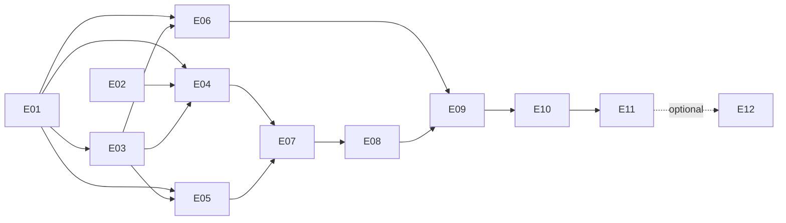

# Long-term roadmap and epic specifications

The roadmap captures scope; linked GitHub issues track execution, discussion,
owners, blockers, and evidence. No calendar deadlines are imposed before the
shell, acoustic, and assembly feasibility work.

## Milestones

| Milestone | Outcome | Epics |
|---|---|---|
| [M0 - Discovery and reference proof](https://github.com/dcuccia/digital-handbell/milestone/1) | Requirements, measured envelope, reusable source baseline and bench evidence | E01-E03 |
| [M1 - Schematic and subsystem prototypes](https://github.com/dcuccia/digital-handbell/milestone/2) | Reviewed reduced schematic, mechanical concept, instrument behavior | E04-E06 |
| [M2 - Custom hardware prototype](https://github.com/dcuccia/digital-handbell/milestone/3) | Manufacturable layout, populated first boards, integrated bring-up | E07-E09 |
| [M3 - Educational pilot and open release](https://github.com/dcuccia/digital-handbell/milestone/4) | Appropriate safety review, usable kit and reproducible release | E10-E11 |
| [M4 - Future wireless exploration](https://github.com/dcuccia/digital-handbell/milestone/5) | Optional evidence-driven connected instrument | E12 |

## Execution and dependencies

Dependencies below are **completion gates**, not a ban on parallel investigation.
For example, initial schematic drafting can start while the bench experiment
runs; schematic freeze waits for its relevant electrical decisions. Measurement
and source-import work can start together.

Use Todo / In Progress / Done on the Project board, with an explicit blocker
noted in issue text when appropriate. An epic is done when its acceptance
criteria and linked evidence are complete, not when a proposed plan exists.
Create focused child issues as implementation details become known.

<!-- TRACKING:START -->
**Public Project:** [Digital Handbell](https://github.com/users/dcuccia/projects/1).
All twelve epics were initialized as Todo with a Phase field matching their
milestone. Current status belongs on the Project/issues, not this static table.
The first ready workstreams are E01 (requirements/measurements) and E02
(provenance/CAD import).

| Epic | GitHub issue | Completion dependencies |
|---|---|---|
| E01 | [#1 Requirements, shell measurements, and acceptance targets](https://github.com/dcuccia/digital-handbell/issues/1) | None |
| E02 | [#2 Provenance, KiCad setup, and reference import](https://github.com/dcuccia/digital-handbell/issues/2) | None |
| E03 | [#3 Bench proof of sound, motion, power, and quiet idle](https://github.com/dcuccia/digital-handbell/issues/3) | E01 |
| E04 | [#4 Reduced handbell schematic and electrical review](https://github.com/dcuccia/digital-handbell/issues/4) | E01, E02, E03 |
| E05 | [#5 Speaker, enclosure, and assembly architecture](https://github.com/dcuccia/digital-handbell/issues/5) | E01, E03 |
| E06 | [#6 Instrument firmware, sound assets, and gesture behavior](https://github.com/dcuccia/digital-handbell/issues/6) | E01, E03 |
| E07 | [#7 Circular PCB layout, DFM, and cost comparison](https://github.com/dcuccia/digital-handbell/issues/7) | E04, E05 |
| E08 | [#8 Prototype fabrication, assembly, and production files](https://github.com/dcuccia/digital-handbell/issues/8) | E07 |
| E09 | [#9 Board bring-up and enclosed instrument integration](https://github.com/dcuccia/digital-handbell/issues/9) | E06, E08 |
| E10 | [#10 Safety, durability, and supervised educational pilot](https://github.com/dcuccia/digital-handbell/issues/10) | E09 |
| E11 | [#11 Open release, kit documentation, and sustainable cost](https://github.com/dcuccia/digital-handbell/issues/11) | E10 |
| E12 | [#12 Optional wireless and advanced sensing](https://github.com/dcuccia/digital-handbell/issues/12) | E11 for product integration only |

These relationships are also recorded as GitHub native blocked-by dependencies.
E12 does not block the first release. Initial issue checklists are seeded from
the specifications below; maintain scope changes in both the specification and
issue, and keep execution progress/evidence on the issue.
<!-- TRACKING:END -->

## E01 - Requirements, shell measurements, and acceptance targets

**Milestone:** M0 - Discovery and reference proof

**Dependencies:** None.

**Goal:** Turn the concept into a measurable brief without prematurely fixing a
speaker, battery, or board diameter.

- [ ] Confirm note range, tuning, fixed/selectable notes, retrigger/damping,
  player age, mass, volume/listening distance, and intended environments.
- [ ] Set latency/jitter, false/missed-trigger, idle-noise/click, runtime,
  charging, and cost criteria; distinguish must-haves from preferences.
- [ ] Measure several shells and make a dated inner-profile drawing with
  tolerances, clapper/handle intrusion, USB-access candidates, and photographs
  or sketches that are licensed for publication.
- [ ] Identify cell envelope/protection/temperature constraints and whether
  playing during charge is required; do not select a charge resistor yet.
- [ ] Define representative build quantities and class-set assembly/charging
  workflow; link open decisions and requirement IDs.

**Acceptance:** An updated requirements register, measurement record, and
approved evaluation criteria make subsequent trade studies comparable.
Unknowns have explicit owners or follow-up issues, not silent defaults.

**Artifacts:** Project brief, dimensioned shell profile, acceptance matrix.

## E02 - Provenance, KiCad setup, and reference import

**Milestone:** M0 - Discovery and reference proof

**Dependencies:** None.

**Goal:** Establish a legally traceable, electrically reviewed source baseline
that a novice can open and inspect.

- [ ] Install KiCad with libraries; document the actual version and beginner
  setup/recovery steps without introducing unnecessary plugins.
- [ ] Pin 5768 sources and relevant comparison sources, record filenames/hashes,
  and add full upstream license/attribution notices before importing.
- [ ] Keep 4884 reference-only until its license version ambiguity is resolved.
- [ ] Import unmodified EAGLE schematic/board into a reference project; compare
  nets, symbol pin numbers, packages, footprints, layers, and design rules.
- [ ] Record all importer repairs and upstream documentation discrepancies;
  define the source-to-derivative block mapping.

**Acceptance:** Another contributor can reproduce the import and open native
files/PDFs without missing libraries. Connectivity differences are explained.
Every imported artifact has an unambiguous provenance/license record.

**Artifacts:** Reference CAD, import report, provenance inventory, setup guide.

## E03 - Bench proof of sound, motion, power, and quiet idle

**Milestone:** M0 - Discovery and reference proof

**Dependencies:** E01.

**Goal:** Reduce the largest electrical/acoustic/software uncertainties with the
integrated 5768 before ordering custom boards.

- [ ] Prepare an owner-approved prototype parts list and wiring plan; use
  current-limited power and suitable speaker loads.
- [ ] Run a minimal, attributed CircuitPython audio/motion demonstration with
  versioned libraries and original or explicitly licensed sound assets.
- [ ] Compare candidate drivers at controlled levels and representative cavity
  conditions; record sound, clipping, current, mass, and depth.
- [ ] Measure strike-to-sound and ready/sleep wake behavior, idle hiss, clicks,
  startup/reset, and USB insertion/removal; evaluate mixer buffering.
- [ ] Evaluate the baseline power selection and establish cell/charger and
  mute/rail questions for schematic freeze; do not infer whole-board current
  from amplifier datasheet figures.

**Acceptance:** A reproducible bench report establishes whether RP2040,
CircuitPython, LIS3DH, and MAX98357A remain suitable candidates and records
specific changes needed. No unexplained "sounds good" or "low power" conclusions.

**Artifacts:** Bench application, asset notices, wiring, measurement report,
electrical recommendations.

## E04 - Reduced handbell schematic and electrical review

**Milestone:** M1 - Schematic and subsystem prototypes

**Dependencies:** E01, E02, E03.

**Goal:** Produce the first actual handbell schematic by adapting understood
reference blocks, not by merging breakout diagrams blindly.

- [ ] Preserve RP2040 core/USB/flash/clock/recovery and the initial GPIO contract.
- [ ] Remove unused servo/NeoPixel/header branches while retaining shared
  amp switching, pullups, biasing, protection, and decoupling.
- [ ] Select exact cell/charger current, source path, protection, temperature,
  cutoff/off and charging-use policy from evidence.
- [ ] Define amp gain/channel/mute, speaker connector, I2S sequencing, status,
  controls, sensor interrupt, and programming/test access.
- [ ] Assign reviewed MPNs/footprints and candidate assembly SKUs; resolve
  substitution risks and stock constraints before layout.
- [ ] Complete the schematic checklist, critical-net comparison, ERC review,
  and an independent electrical review with resolved findings.

**Acceptance:** Native KiCad sources, readable PDF, preliminary BOM and review
record cover every required block. Charge safety, power states, and firmware
pin mapping are explicit. No fabricated "validated" status from ERC alone.

**Artifacts:** Schematic, libraries, BOM, net/pin map, source-change log,
electrical review.

## E05 - Speaker, enclosure, and assembly architecture

**Milestone:** M1 - Schematic and subsystem prototypes

**Dependencies:** E01, E03.

**Goal:** Select a mechanically credible, acoustically evaluated packaging
concept before imposing a PCB outline.

- [ ] Compare shallow/light and deeper drivers in representative rear cavities.
- [ ] Prototype USB-slot/opposite screw, separate speaker carrier, and
  multilevel carrier concepts with cardboard/inert mock-ups then prints.
- [ ] Establish USB anchor/support load path; compare SMT threaded hardware
  against carrier-mounted captive nuts/inserts.
- [ ] Verify outward-facing connector access and complete assembly order,
  including speaker plug, cell retention, insulation, and service access.
- [ ] Produce a tolerance-aware 3D stack and compare one PCB versus stacked
  boards without committing on gross area alone.

**Acceptance:** A chosen concept has measured fit, explained acoustic tradeoffs,
safe cell/screw clearances, an assembly demonstration, and an outline/height
keepout package suitable for PCB placement.

**Artifacts:** Mechanical drawings/source CAD, mock-up results, selected speaker
evidence, assembly sequence, PCB envelope.

## E06 - Instrument firmware, sound assets, and gesture behavior

**Milestone:** M1 - Schematic and subsystem prototypes

**Dependencies:** E01, E03.

**Goal:** Evolve demonstration code into responsive, reproducible instrument
behavior without conflating audio buffering and motion sampling.

- [ ] Record non-identifying timestamped ringing/handling/playback-vibration
  traces; define replayable false/missed-trigger scenarios.
- [ ] Implement and tune a nonblocking gesture state machine with hysteresis,
  retrigger handling, orientation/gravity treatment, and velocity response.
- [ ] Compare accelerometer-only results against criteria; justify any gyro.
- [ ] Implement selected note/configuration, damping/polyphony, envelopes,
  digital limits, and quiet/power modes with bounded resource use.
- [ ] Establish asset provenance, firmware/library versions, USB update/recovery,
  and custom-board definition/authorized identity requirements.

**Acceptance:** Replay and hardware evidence cover required musical behavior,
latency/jitter, false triggers, audio resource limits, and recovery. Final
enclosed-system regression remains E09, not assumed from the bench.

**Artifacts:** CircuitPython application, configuration, licensed assets,
dataset/replay procedure, measurements, programming guide.

## E07 - Circular PCB layout, DFM, and cost comparison

**Milestone:** M2 - Custom hardware prototype

**Dependencies:** E04, E05.

**Goal:** Demonstrate a routed, manufacturable design within the measured
envelope and compare realistic assembled costs.

- [ ] Place actual courtyards/connectors/test access inside mechanical keepouts.
- [ ] Attempt one-face SMT/two-layer routing with continuous return references,
  short amp supply loops, paired BTL routing, and reviewed USB/core layout.
- [ ] If needed, compare four layers and stacked boards with explicit
  diameter/depth, assembly labor, yield, and cost tradeoffs.
- [ ] Review footprints/polarity, 3D clearances, thermal copper, test points,
  fiducials/panel tabs, USB overhang, and unusual fastener assembly.
- [ ] Run DRC and independent layout review; obtain current BOM/assembly
  feasibility and quote scenarios for JLCPCB and OSH Park plus separate assembly.

**Acceptance:** Native layout, 3D stack, resolved review/DRC findings, supplier
constraints and complete cost model justify actual diameter/layers/assembly
side. No fit claim based only on chip area.

**Artifacts:** PCB sources, fabrication-rule profiles, placement/3D images,
BOM availability snapshot, DFM report, comparative costs.

## E08 - Prototype fabrication, assembly, and production files

**Milestone:** M2 - Custom hardware prototype

**Dependencies:** E07.

**Goal:** Obtain a small traceable prototype batch with reproducible
manufacturing data, after explicit purchase approval.

- [ ] Generate Gerbers, drills, BOM/CPL, assembly drawings and programming/test
  instructions from a tagged source revision.
- [ ] Inspect every assembler preview orientation/polarity, approved part
  substitution, panel/rail/tab geometry, and connector/fastener exception.
- [ ] Obtain owner approval of quantity, complete cost, supplier, and known
  prototype limitations before placing any order.
- [ ] Record actual built BOM/revisions, incoming inspection, populated-board
  photos, assembly exceptions, and rework.

**Acceptance:** The delivered batch is traceable to reviewed files and approved
substitutions; incoming results and unexplained discrepancies are recorded.
Delivery is not electrical bring-up or child-use qualification.

**Artifacts:** Versioned fabrication package, sanitized order/build record,
incoming inspection, assembled prototypes.

## E09 - Board bring-up and enclosed instrument integration

**Milestone:** M2 - Custom hardware prototype

**Dependencies:** E06, E08.

**Goal:** Prove the actual custom hardware and firmware together, then repeat
key measurements in the real shell.

- [ ] Perform staged current-limited bring-up: shorts/rails, recovery/flash/USB,
  sensor/interrupt, I2S/amp, power switching and charging functions.
- [ ] Record current, thermal, headroom, noise/clicks, latency, runtime and
  charging transitions across defined battery/USB conditions.
- [ ] Repeat motion tests with speaker vibration, final mounting and actual
  handling; tune and regression-test against recorded criteria.
- [ ] Evaluate repeated units for variation, document anomalies and corrective
  changes, and decide whether another board spin is needed.

**Acceptance:** Integrated results satisfy the approved engineering criteria or
lead to explicit revisions. Firmware, cell, speaker, carrier and PCB versions
are linked for every result; no unresolved blocking anomaly is hidden.

**Artifacts:** Bring-up log, integrated measurement report, known issues,
revision disposition.

## E10 - Safety, durability, and supervised educational pilot

**Milestone:** M3 - Educational pilot and open release

**Dependencies:** E09.

**Goal:** Establish the appropriate review and operational safeguards before
any use by children or wider educational distribution.

- [ ] Resolve intended age/market and instrument-versus-toy classification with
  qualified guidance; identify applicable compliance work.
- [ ] Review cell access/retention/temperature, sharp edges, small parts,
  screw intrusion, cable abrasion, sound exposure and fault handling.
- [ ] Assess USB/structural retention, foreseeable shaking/drops and wear using
  appropriate procedures; do not improvise destructive live-cell testing.
- [ ] Define approved charging/storage/maintenance and supervision practices.
- [ ] Conduct only an appropriately authorized/safeguarded pilot; capture
  non-identifying usability, assembly, reliability and musical feedback.

**Acceptance:** Required reviews, safeguards, operating instructions and pilot
authorization are recorded before deployment. Any compliance/certification
claim is supported by its actual scope and evidence.

**Artifacts:** Risk/review record, durability results, operating guidance,
sanitized pilot findings and release blockers.

## E11 - Open release, kit documentation, and sustainable cost

**Milestone:** M3 - Educational pilot and open release

**Dependencies:** E10.

**Goal:** Publish a reproducible, attributed project that others can build,
program, maintain, and budget without hidden expertise or missing files.

- [ ] Publish native electronics/mechanical sources, PDFs, manufacturing files,
  actual BOM/substitutes, firmware, assets, and complete license notices.
- [ ] Write novice assembly, polarity, programming, recovery, note configuration,
  charging, maintenance, troubleshooting and replacement-part instructions.
- [ ] Record actual per-unit/per-set cost, assembly time, yield and manual work
  at the built quantity; distinguish projections for larger batches.
- [ ] Verify a fresh checkout/export and an independent build of the documented
  revision; document tool versions and supplier-specific differences.
- [ ] Publish known limits, evidence scope, supported configurations and
  maintenance/contribution workflow without implying vendor endorsement.

**Acceptance:** A tagged release is reproducible and fully attributed, has
usable kit documentation, and accurately states its safety/compliance status
and cost assumptions.

**Artifacts:** Public release, build/educator guides, license inventory, actual
cost report, supported-configuration matrix.

## E12 - Optional wireless and advanced sensing

**Milestone:** M4 - Future wireless exploration

**Dependencies:** E11 for product integration; exploratory research may begin earlier.

**Goal:** Revisit the original wireless/host/6-DOF ideas only when a concrete use
case justifies added cost, energy, software and mechanical complexity.

- [ ] Define whether wireless is for configuration, synchronization, MIDI,
  telemetry or audio; specify latency/reliability/privacy/offline requirements.
- [ ] Compare ESP32-S3 against C3 and historical alternatives for CircuitPython
  APIs, USB provisioning, memory, radio power, assembly and actual cost.
- [ ] Evaluate antenna keepouts and propagation inside the metal bell; do not
  treat a radio-capable chip as a working RF design.
- [ ] Evaluate six-axis sensing only for measured unmet gesture requirements.
- [ ] Prototype interoperability, identity/provisioning, updates and power
  modes while preserving a usable standalone instrument.

**Acceptance:** An evidence-backed go/no-go decision and separate hardware/
firmware requirements precede any replacement of the working non-wireless
baseline. A negative result is a valid outcome.

**Artifacts:** Use-case/architecture decision, comparative prototype results,
optional future revision plan.
