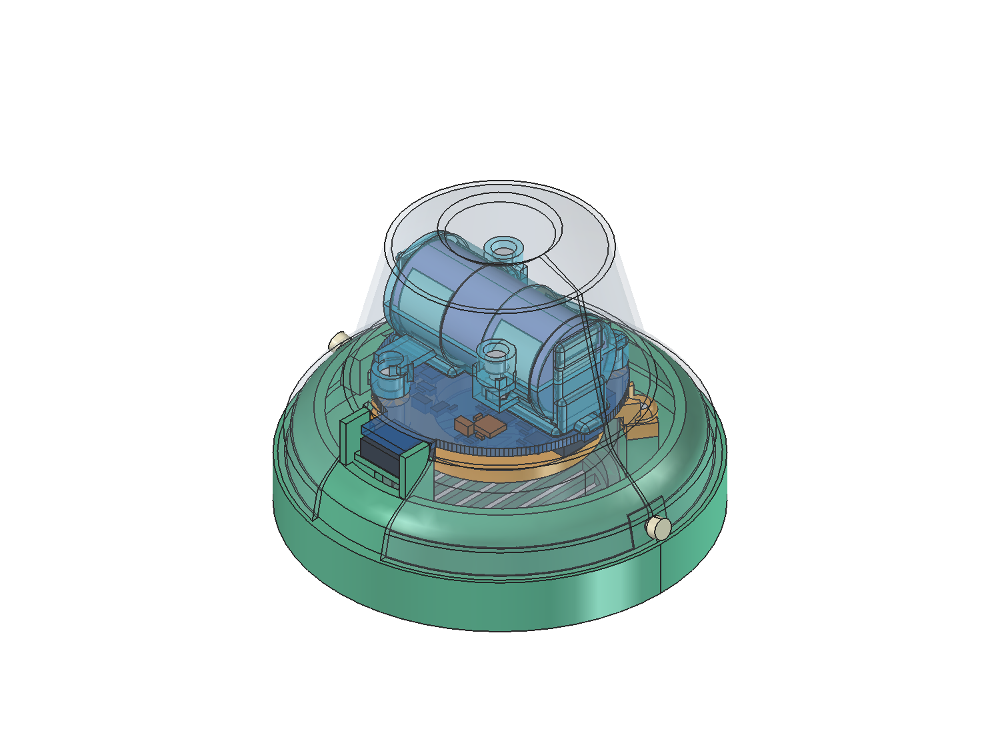

# Measured-shell T8 integration and pre-routing review

**2026-09-11: owner-requested next revision.** Preserve the September 7 print
snapshot and September 9 wing/cartridge draft. This revision targets a complete
placed assembly for review in FreeCAD **before starting routing**, not a
fabrication or live-cell release.

## Measurements and the working shell

The [dated measurement record](measurements/2026-09-11-shell-speaker-inputs.json)
preserves the raw caliper reports, the owner's clarifications, and derived
quantities separately. All axial stations are measured from the mouth toward
the handle.

| Station / feature | Owner report |
|---|---|
| Mouth, z0 | OD73.15 / ID71.68 |
| z4.90 | OD73.15 / ID69.75 |
| First concave taper | 10.00 axial travel after z4.90; end at **z14.90**, explicitly confirmed |
| End of that taper | Rough OD51.50 / ID50.00 |
| Before final taper | OD38.42 at approximately **z41.75** |
| Bell body height | 45.55 |
| Handle | Height85.50; OD18.52 at bell, OD15.01 at top |
| Speaker magnet | **OD21.70**, superseding22.00; owner confirmed this means the speaker, not a battery magnet |
| Other speaker dimensions | Earlier D40/H19, basket rear D32 at z12, magnetH7 remain current |

The owner subsequently measured the lip wall directly as **1.15 mm** and
requested that uniform thickness as the working CAD assumption. It does not
reconcile with all paired OD/ID reports: half their differences is0.735,
1.70 and0.75 mm at the first three stations. Do not silently rewrite those
readings. Prioritize measured inside stations for cavity fit, document how the
1.15 mm model wall is constructed, and label the inferred **ID36.12 at
z41.75** as a calculation, not a caliper measurement.

Intermediate concave curvature, the final closure above z41.75, roundness,
production variation and handle-fastener intrusion remain unmeasured. A
rendered curve is not new measurement evidence.

**Same-day spacing feedback:** the owner visually estimates approximately
1 mm of recoverable speaker-to-PCB headspace in the print. Record this as an
[eyeball estimate](measurements/2026-09-11-spacing-feedback.json), not a
minimum-clearance measurement. Evaluate 0.5 and 1.0 mm PCB/battery compression
with the speaker fixed, and identify the limiting fitted component. Reclaim
that space where the actual geometry permits before increasing exterior
front protrusion; bare-board clearance alone is not sufficient.

The owner confirms the new printed design fits inside the bell but seems
slightly undersized radially. This supports revising the front register and
flange; it does not establish a measured clearance or require enlarging the
43 mm electronics disk. The original D72 external flange was designed for an
assumed D70 mouth, so its bearing against the now-measured ID71.68 needs
reconsideration rather than uniform scaling of every part.

## Electrical and battery scope

The [native T8 revision](../hardware/handbell/iterations/t8-protected-draft/README.md)
now implements the separate circuit and placement: **83 fitted components**
(70 speaker-side F / 13 handle-side B), including two Keystone 254 revision C
SMT contacts, the Winbond UX flash and eight protection components. The
[electrical handoff](t8-electrical-revision.md) owns the exact pin/land maps,
source evidence and limitations. This is not a blanket circuit or live-cell
approval.

Use the owner's preferred **Vapcell T8 button-top** as the next candidate and
the stocked **W25Q16JVUXIQ TR, 2 MB** flash option. The flash requires its
USON2x3 footprint; it must not be assigned the inherited USON4x4 lands.
The [flash source review](flash-sourcing.md) retains exact ordering and
firmware compatibility evidence.

The seller's approximate D16.4 x L34 T8 dimensions remain supplier evidence,
not owner measurements or maximum tolerances. Exact positive-button geometry
and the conflicting generic manufacturer button-extension note remain
contact/retention qualification items. The
[cell/protection review](battery-contact-options.md#2026-09-11-vapcell-t8-and-pcb-level-protection-alternative)
records current and charge-profile evidence.

Keep the protection design compact and deliberate. A boost-only fallback is
not equivalent: a short on the battery rail or elsewhere on the board can
bypass the converter, and its low-voltage operation does not prevent cell
overdischarge. Review a small single-cell fault protector and isolation
devices, all charging/discharge paths, and actual footprint area. No fuel
gauge or series-cell balancing is required by this 1S architecture.

The implemented BQ29700DSER/common-drain CSD83325L/shunt stage occupies
approximately an **8 x 6 mm planning area**, with six associated passives.
Its conservative overcurrent selection can trip below 2 A at low cell
voltage; it is not a guaranteed 3 A current regulator or a promise of
full-output audio at every state of charge. Exact fault-current/SOA, thermal,
charging, cell-temperature and reverse-insertion gates remain in the
electrical handoff. Do not present the added protection as closing those
unimplemented functions.

The earlier schematic connected battery negative directly to board GND.
With a low-side protector, **raw cell negative and protected system GND are
different nets**, joined through the conducting protection stage in normal
operation and separated on cutoff. USB shield/ground, screw pads and signal
returns must not accidentally bridge that separation. If a different topology
is selected, document its actual grounding contract rather than repeating this
example as an implemented fact.

This low-side arrangement is now implemented as `CELL_NEG` versus `GND`.
USB signal ground is protected system GND. The retained X6 shell anchors
M1-M4 are **unassigned**, not a reviewed shield-to-ground bond; cable/shield
contact can still reference external metal, so mechanical insulation remains
necessary.

Keep the metal bell electrically isolated from terminals, cell can, board
fasteners and USB hardware. A floating bell can still short a cell if both
terminals contact it. The metal can of a conventional cylindrical Li-ion cell
is associated with negative; the wrapper alone is not an abrasion-resistant
holder. A direct short across the raw cell outside the protected interface
cannot be cleared by a downstream board protector.

The requested **1-1.5 mm proud plastic** is a geometric design target, not an
electrical insulation rating. Apply it to terminal guards and likely contact
directions during insertion, installed use and removal, not merely the
largest z coordinate. The capture structure must carry battery motion and
insertion loads independently of SMT solder joints. Temperature charging
policy, reverse insertion, vent clearance and approved rechargeable-cell
identification remain explicit responsibilities.

## Mechanical and service scope

Make the following interfaces agree in a single assembled model:

- The measured mouth register, an external flange with real bearing area,
  and positive removable shell attachment.
- A tighter clearance opening around the D21.70 magnet, without pretending
  that print allowance is a measured tolerance or applying unspecified force
  to the speaker cone, basket, magnet or vent.
- Actual battery-contact lands and original dimensioned contact proxies,
  an insulating cradle/cover, terminal shielding and accessible fasteners.
- PCB support and tool paths that do not load the IMU, bridge electrical
  isolation, or collide with the cell.
- USB mouth position relative to the **outside** of the working shell,
  footprint/anchor support, insulated cutout and plug approach.
- A realistic cartridge insertion/removal path. A connector protruding
  through a closed side hole can trap the cartridge; serviceability must not
  be demonstrated only with that shell hidden.

The former draft used **M2 screws**, 2.2 mm PCB clearance drills and
**D3 x L4 insert envelopes**. Those insert envelopes were placeholders, not a
selected M3 or M2.5 receptacle. Do not force M3 screws into the fit prints.
Select and document a coherent new screw/insert or captive-nut system, its
clearance holes, engagement and installation steps. A molded insert pocket
and a screw-clearance hole serve different purposes.

## Completion and routing sequence

### Delivered placed-review assembly

The [coordinated T8 study](../mechanical/studies/2026-09-11-t8-cartridge/README.md)
contains the exact 83-part placement, full contact primitives, four structural
pieces, speaker, provisional cell, fasteners and working shell. Open
`mechanical\studies\2026-09-11-t8-cartridge\t8-cartridge.FCStd`.
The complete model was also opened in FreeCAD 1.1.3 using a session-only view
copy; the generated native file was not resaved or changed by that GUI review.
The image below hides the external handle and makes the shell, cover and PCB
partly transparent for internal visibility; it does not remove physical parts
from the supplied assembly.

The current four pieces are the body/grille/register/USB bezel, speaker yoke,
insulating battery cradle and removable cover. Six **M2x6 screws with M2 captive
nuts** replace the former heat-set-insert placeholders. Two separate insulating
shell screws attach the cartridge; remove these and unplug USB before pulling
the whole cartridge through the mouth-open slot. Speaker insertion still
precedes yoke and PCB installation.

The full Keystone 254 contact/guard envelope, rather than the bare cell,
requires the proposed **6.25 mm mouthward shift**. The speaker starts at z-6.25
and the grille at z-10.75; the D75.5 flange is external. The model's nominal
guard-to-shell gap is about 0.294 mm with a 1.0 mm plastic target. These are
calculated values against an assumed/interpolated shell, not measured fit
tolerances or an owner-approved exterior. The USB mouth is approximately
0.045 mm outside the working wall at midheight only, not flush across its
entire face.

**The suggested 1 mm spacing reduction is not available unchanged.** In the
current model the bare-board-to-magnet gap is 1.5 mm, but the tightest fitted
parts leave only 0.5 mm. The separate sensitivity preserves component XY and
heights and moves the front-side parts toward the fixed speaker:

| PCB mouthward reduction | Speaker result | Unchanged-yoke result |
|---|---|---|
| 0.5 mm | D4, IC1, IC4, Q3 and Y1 touch with zero positive clearance | About 0.250 mm minimum gap; no material overlap |
| 1.0 mm | 30 component proxies intersect the speaker | About 0.250 mm minimum gap; no material overlap |

The [fit report](../mechanical/studies/2026-09-11-t8-cartridge/fit-report.json)
retains the per-component results and expressly marks this comparison as
**not applied** to the delivered geometry. Reclaiming that space would need a
new placement or better supported component/speaker geometry, not simply
shorter standoffs. It does not retrospectively contradict the owner's visual
observation of open space elsewhere in the print.

The native and full STEP retain both contacts. The inert PCBA STL explicitly
omits them because the current folded-root approximation is not a valid
manifold print mesh; it is not a spring/contact fit test. Exact cell/button
dimensions, loaded contact shape/force, reverse insertion, insulation seams,
thermal/charging policy, hardware strength, USB lands/tails and actual printed
fit remain open. No live-cell use, physical shell modification, routing or
fabrication is approved by this review artifact.

### Remaining sequence

1. Record the measurements and settle the working geometric interpretation.
2. Implement the separate native schematic/placement with flash, cell-contact
   and compact protection changes; preserve unrelated connections and source
   libraries.
3. Generate the new mechanical study from that exact placement manifest.
   Include the cell, contacts, insulating capture, shell attachment, speaker,
   USB access and all fasteners rather than a board-only approximation.
4. Review native correspondence, component/structure clearances and assembly
   paths. Keep open findings visible; an ERC/DRC pass is not safety approval.
5. Open the complete FreeCAD assembly for owner review. **Do not begin
   routing merely because generation succeeded.**
6. After placement/interface approval, route the critical power, returns,
   clock/flash and USB structures first, then the remaining nets. Finish
   electrical/DFM/parity and mechanical review before manufacturing exports.

Final copper still needs exact power-component selection, charging/use policy,
USB footprint/fab compatibility and the chosen layer/copper/stackup rules.
The known inherited USB hole-clearance findings may not be hidden by lowering
the rule. Firmware completeness and a production quotation do not need to
block a clearly identified placement review.

Owning epics: E01/#1 for measurements, E04/#4 for power/flash/contacts,
E05/#5 for capture/service, E07/#7 for placement/routing, and E10/#10 for
insulation, retention and eventual use qualification.
