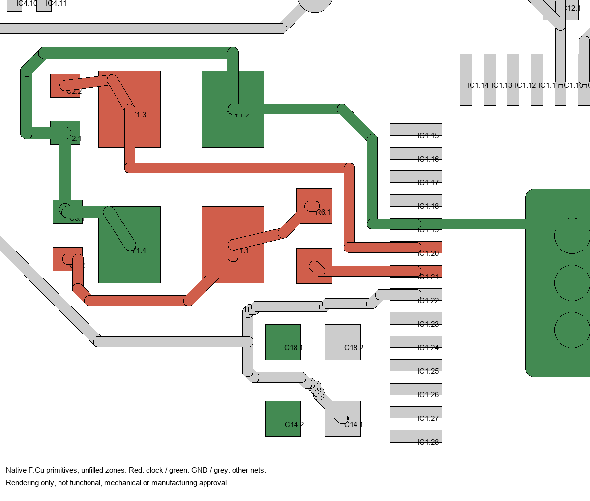
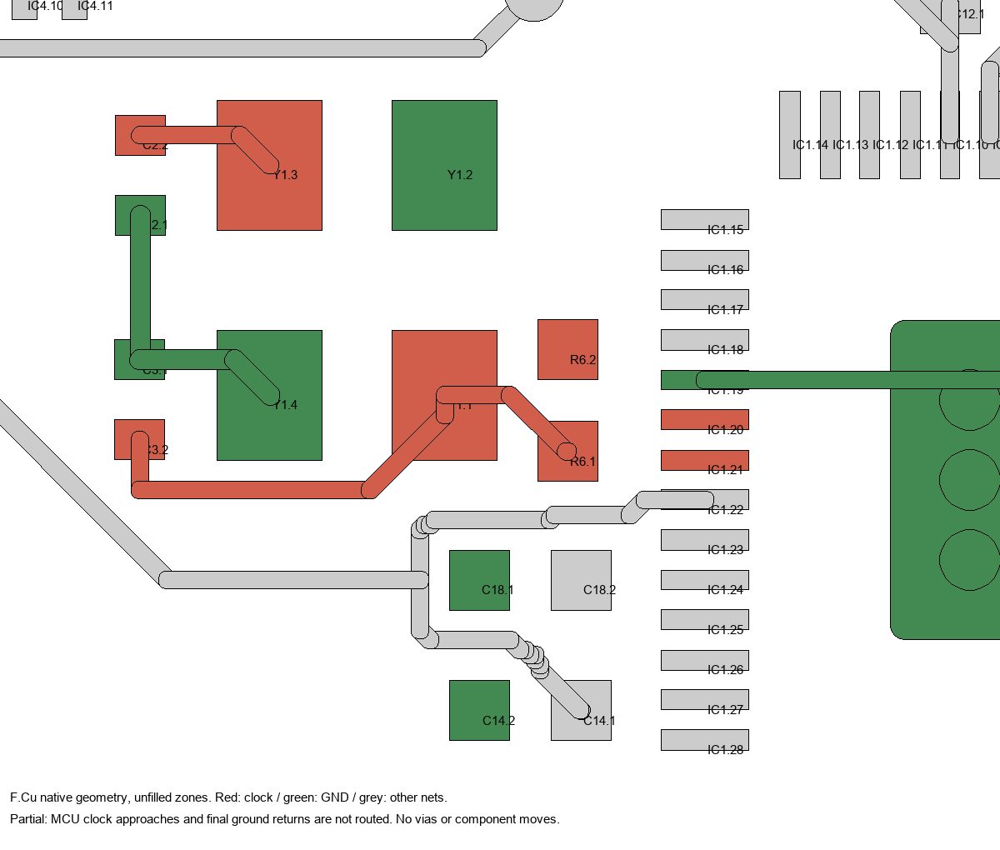

# Clock revision and local routing - not a fabrication package

September 14, 2026 bounded foreground items. This isolated derivative preserves
the recovered routing checkpoint under `input-checkpoint`; its exact source and
output hashes are in `reports/clock-definition.json`. The recovered
`printed-bell-quote-candidate` and accepted mechanical models were not edited.

The definition-only stage is preserved in commit `702f53b`, the first local
connections in `54a40d7`, and library metadata alignment in `1a83d8c`. Older
reports bind their named stages, not later PCBs. The clock geometry is bound
by `reports/clock-approaches.json`; USB geometry is bound by
`reports/usb-geometry.json`; identities by `reports/remaining-identities.json`.
**The current power-land board is bound by `reports/power-lands.json`; the
latest manifest-only revision is bound by `reports/device-envelopes.json`.**
Figures and hashes in the earlier stage sections below are historical.

## September 15 device envelopes and resume

The owner has resumed bounded work. D3/D4, Q1/Q2/Q4 and U3 now carry the
already documented conservative package-envelope enlargements. Current
centers, rotations and native-to-proxy offsets are preserved, including Q1's
earlier routing move. No component moves or native PCB/schematic changes occur.
The reused overlap/outline/speaker screen introduces no conflicts.

These are conservative screens, not measured mounted dimensions or complete
CAD approval. Full mechanical rebinding remains required. The native board
retains 56 opens and all 83 MPNs; no electrical rerun is claimed for this
manifest-only change. The older ground report still binds its earlier manifest
and exact unchanged PCB, not this enlarged-envelope manifest.

## Power land patterns applied; owner pause

The eleven selected L1, C26-C28, C1/C4/C5/C19/C20 and FB1/FB2 land patterns
are applied through four dedicated libraries. Ferrites have their explicit
mask/paste windows rather than duplicated automatic apertures. All component
poses, envelopes, copper primitives and nonselected footprints remain intact.
The adapted hardware retains CC BY-SA 3.0; no vendor CAD was imported.

Both quiet pickoffs and the all-front boost paths survive the actual smaller
lands. The [local report](reports/power-local-check.json) remeasures 77 adjacent
tracks: 31 have increased primitive-only centerline exposure, with unchanged
drawn widths. This excludes fill and is not an equivalent-resistance or
current-capacity calculation.

The filled board has **56 opens, zero other native DRC errors and 232
silkscreen/text warnings**, with empty native ERC and all **83 fitted MPNs**
retained. Its exact PCB SHA-256 is
`f6a9d31192c7e59c4b81b7bcb281e23fd06cdc201e8a7a1f180ae7a8f860e3e4`.
The [public ground report](reports/power-ground-check.json) preserves all
previous connected groups and protected returns. Its checker and the
[plan contract](reports/front-ground-plan.json) no longer depend on private
recovery files; [commands and scope](../../../../docs/pcb-closure-plan.md#reproducible-filled-ground-check)
are recorded in the closure plan.

**Historical September 14 pause; resumed September 15 above.**
Remaining device envelopes/land dispositions and existing-part audit precede
final routing; full CAD/bezel, assembly and powered qualification remain open.
The identity-stage schematic PDF below is the last circuit-view export; later
power changes alter footprint IDs, not its visible circuit. All matched release
exports must be regenerated at the final handoff.

## All fitted part identities applied

All **83 fitted parts now have matching MPNs in the schematic, PCB and
manifest**, including both rear contacts and mixed-mount X6. One final batch
applies the 17 remaining selected device/power identities without new sourcing
or geometry changes. Q2's vendor-code value label becomes `AO3400A`; L1's
stale `MPN pending` suffix is removed while retaining 1 uH.

The [complete-identity schematic PDF](reports/identified-schematic.pdf) is the
current novice-readable circuit view. Native ERC is empty. All copper, pads,
nets, poses, fill, rules and other geometry are unchanged from the USB stage;
its 57 opens and geometric evidence remain applicable. The current PCB SHA-256
is `7f2abd76c716364b77356bb251e889ea2dfcc1efe9eaa3e33e55b59a7cd8ba16`.

This closes **blank identity fields**, not footprint/assembly qualification or
the supplier BOM. Required power lands, device-envelope/disposition work,
existing-part audit, full routing and exact mechanical integration remain.
`tools/apply_remaining_identities.py` uses the shared field editor and checks
all fitted identities plus the unchanged non-identity native structure.

## USB geometry and local approaches corrected

X6 now uses the drawing-based `Handbell:USB_C_HRO_TYPE_C_31_M_12_Handbell`
footprint and selected **HRO TYPE-C-31-M-12** identity. The four real plated
slots have 0.25 mm nominal annuli; the four outer GND/VBUS lands and reduced
paste move as documented, while inner lands and locators remain intact.
Native minimum outer-land/locator clearance is **0.37536 mm**. Diagnostic
Excellon output contains four actual slot commands, not merely oval copper.

One local correction clears the resulting CC1/CC2/VBUS route conflicts:
adjust the CC approaches and shorten the VBUS wrap using its existing via.
Two existing vias move, no vias are added, and trace widths are retained.
The relocated VBUS via is tented on both faces under the exercised native
settings; actual solder-mask/assembly acceptance remains a supplier gate.
No component or connector datum moves. The USB conservative envelope and
rear reservation grow by the documented 0.15 mm front allowance; the printed
bezel and full assembly have **not** yet been rebound.

The filled candidate preserves all previously connected groups and both
private returns. There are **57 opens, zero native DRC errors and 234 remaining
silkscreen/text warnings**; native ERC is empty. This is not complete routing,
current-capacity, USB signal-integrity, functional or manufacturing approval.
All four anchors require the explicitly quoted secondary soldering operation.
X6 remains a fitted mixed-mount part, not an SMD-only export exclusion.

Native MPN coverage is **66/83**, with 17 blank. The exact PCB SHA-256 is
`060bab15944bcd8be8b6de61f05d242e2d975501fc900a21a379cd2b8d413ff5`.
`tools/apply_usb_geometry.py` stages this correction from its pinned input
without overwriting an existing package; refill/review still follow generation.
The custom footprint adapts the retained Adafruit hardware under CC BY-SA 3.0;
no stock KiCad or manufacturer CAD was newly imported.

## Recorded-settings ground fill accepted (preceding checkpoint)

The preserved replay restores C25.2 to all 21 previous ground peers, without
moving C25 or adding a trace. Both previous connected-group baselines survive;
the filled-area, private-pickoff, exclusion and foreign-net guards pass.
Native and independent connectivity agree on **57 remaining opens**.
The four existing USB hole-clearance errors and other physical findings are
unchanged. This is a filled routing checkpoint, not a quote-ready board.

Only filled-polygon caches changed; component poses, all other PCB declarations,
schematic, project rules and circuit identities remain intact. The exact PCB
SHA-256 is `307122d6838df5dda24331091c463930889a2185fb01b57ae95cab107337c408`.
The saved replay's full check completed in about 64 seconds; graph construction
dominated, while connected-component comparison was negligible. Do not attribute
the earlier timeout to pair enumeration or infer which individual fill setting
caused the C25 difference.

`tools/refill_front_ground.py` reproduces those exact bytes from the unfilled
starting board using KiCad 10.0.6. It reads the adjacent project, applies the
recorded conservative in-memory limits, and splices only fill caches into a
**new working file**. It refuses overwrite, custom-rule files and an unexpected
zone plan. It neither changes project rules nor certifies its output. Example
from the repository root, with a finite native-process deadline:

```powershell
python -c "import subprocess; subprocess.run(['python', r'tools\refill_front_ground.py', r'hardware\handbell\iterations\printed-bell-clock-draft\handbell.kicad_pcb', r'YOUR_EXISTING_WORK_DIRECTORY\filled.kicad_pcb'], check=True, timeout=60)"
```

Use the exercised isolated KiCad configuration for subsequent CLI DRC; private
configuration is not a release input. Refill after geometry changes and repeat
the relevant gates. The [closure plan](../../../../docs/pcb-closure-plan.md)
puts necessary USB/power footprint corrections before final signal routing.

## Non-boost capacitor identities applied

The 26 non-boost capacitors now carry their selected Murata identities:
**23 previously blank MPNs filled**, with C2/C3/C30 confirmed. The existing
15 pF C2/C3 revision is preserved; no capacitance labels, voltage selections,
footprints, placements or copper changed. C26-C28 are excluded. C30's former
TI circuit link is retained as `CircuitReference` alongside its actual
capacitor datasheet.

The [current schematic PDF](reports/capacitor-schematic.pdf) and
`reports/capacitor-identities.json` record this step. Native MPN coverage is now
**65 of 83 fitted parts**, with 18 still blank. The five 10 uF capacitors'
documented land/paste treatment remains a separate pending change, as do DC-bias/
effective-capacitance, clock-drive, assembly, full mechanical and supplier gates.
Identity coverage is not manufacturing approval. Physical findings and the
82 unfilled opens are unchanged.

## Earlier ground-fill investigation (superseded by acceptance above)

The [isolated refill investigation](reports/front-ground-refill-investigation.json)
preserved the existing one-F-zone/ten-exclusion plan without modifying the
then-accepted PCB. A generic refill produced 58 opens, but comparison with the
recovered filled baseline exposed loss of C25's previous ground connectivity.
The private-pickoff and exclusion guards passed; the connectivity regression
still makes that proposal unacceptable.

Replaying the earlier fill's explicit in-memory settings produced a different
working copy. Its first full independent check reached a 60-second process
limit. That historical report remains unchanged; the focused continuation
above subsequently established continuity and accepted the replay, not the
generic trial. The former 82-open figure describes the unfilled starting board.

## Ordinary resistor identities applied

All 27 ordinary 0402 resistors now carry the selected Yageo orderables in the
schematic, PCB and manifest: **23 previously blank MPNs filled and four existing
MPNs confirmed**. All resistance values, footprints, poses, pads, nets and
copper are unchanged. R27, the current-sense shunt, is excluded.

The manufacturer datasheet field now links to the verified Yageo RC_L family
sheet. The former TI BQ2970 links on R25/R26/R28/R29 are preserved as hidden
`CircuitReference` fields rather than discarded or labelled resistor datasheets.
The [current schematic PDF](reports/resistor-schematic.pdf) accompanies the
scoped report. The native manifest now has **42 of 83 fitted parts with an MPN**,
leaving 41 blank. This is identity coverage, not footprint, supplier, power or
assembly qualification; physical findings and the 82 unfilled opens persist.

## Q3 source-selection identity applied

Q3 now uses the selected **Diodes Incorporated DMP2045UFY4-7** orderable in the
schematic, PCB and placement manifest. The visible value is DMP2045UFY4, with
the exact packing suffix in the MPN field. The generic P-channel symbol,
corrected DFN drain/paste/mask, actual proxy displacement, all pin/net mappings,
component placements and every copper item are unchanged.

The [updated schematic PDF](reports/q3-schematic.pdf) and scoped native report
record the change. All 306 exported reference/pin net assignments match the
previous circuit; ERC remains empty, physical findings and the 82 unfilled
opens are unchanged. This is not an electrically identical substitute:
startup, USB transitions, low-cell drop, temperature and standby leakage still
require evaluation. The old gate-leakage guarantee is not carried forward.

## Current all-front clock routing

The three oscillator nets and both crystal-case/load-capacitor ground returns
now have physical F-side connections to the MCU clock pins and exposed ground
pad. This completes the **local clock network**, not the whole board or a
functional oscillator qualification.

Thirty new F segments replace thirteen earlier local-clock segments. No vias
or B-side copper were added. The small placement changes are Y1 left 0.50 mm
and down 0.20 mm; C2 left 0.30 mm and down 0.10 mm; C3 left 0.25 mm; R6 left
0.35 mm and turned 180 degrees. Values, pad primitives and pin/net identities
are unchanged. All other components, existing nonclock copper, outline,
mounting holes, USB and contact interfaces remain unchanged.

The ground route stays on F because the raw-negative contact **metal base**,
not merely its solder pads, lies behind this cluster. A copper-only check would
not qualify ground vias beneath that metal.

Native physical paths confirm all thirteen recorded clock/ground endpoint pairs
on F without relying on zone fill. Moved pads and new tracks clear foreign
copper by the conservative 0.20 mm screen. Same-face component envelopes do not
overlap and remain within D43; these are screening proxies, not qualified
assembly tolerances. Matching no-refill DRC moves from **86 to 82 unconnected
items**, with no new physical findings and no clock library mismatches. The
four inherited USB hole-clearance errors and silkscreen/text findings remain.



Full mechanical rebinding, zone refill and the other unfinished electrical/
manufacturing gates remain open. Clock frequency, startup and drive must be
evaluated on powered hardware, including low-cell/LDO-dropout operation; the
reference capacitor values do not measure this layout's stray capacitance.

## Earlier definitions and first local connections

- Y1: Abracon ABM8-272-T3, four-terminal schematic symbol with case pins 2/4
  connected to GND, dedicated 3.2 x 2.5 mm package and manufacturer-example lands.
- C2/C3: Murata GRM1555C1H150JA01D, 15 pF, dedicated manufacturer-example lands.
- R6 remains 1 kohm. No component centres, mounting holes, contacts or USB
  interfaces moved. Nonclock footprints and tracks/vias are unchanged.
- The definition stage deliberately removed old oscillator-net copper and
  cached zone fills. The first routing increment adds **15 front-copper segments,
  no vias and no component movements**. Existing copper is unchanged.
- New connections: C2 to Y1 pin 3; C3 to Y1 pin 1 and R6 pin 1; the C2/C3
  ground pads to Y1 pin 4; and IC1 ground pin 19 to its exposed ground pad.
  These are partial connections, not a completed oscillator or ground network.



This implements the separately recorded [clock selection](../../../../docs/device-component-selection.md),
not a repair of a demonstrated fault in Adafruit's design. Provenance and CC
BY-SA obligations remain in `LICENSE.txt` and `notices`.

## Earlier-stage evidence

KiCad 10.0.6 loaded the native board and both dedicated footprints. The exported
netlist establishes both Y1 case pins on GND and the intended C2/C3/R6 oscillator
nodes. ERC reports zero findings; the unchanged recovered source also reports
zero. `reports/clock-schematic.pdf` is the exported schematic for novice review.

The enlarged Y1 screening rectangle fits without moving components. Its nearest
same-face proxy gap is approximately 0.40 mm to R6. This is a nominal 2D bounding
box screen, **not** courtyard, soldering, mechanical or manufacturing acceptance.

The initial whole-board DRC/refill attempt exceeded its **60-second timeout**.
On resuming, even no-refill DRC reached a 30-second limit under the normal user
configuration. One corrective attempt with an initialized isolated KiCad
configuration completed. The specific offending user setting is not established.
Both before/after reports now use that same isolated configuration and **no
zone refill**; private preferences are not distributed.

The new tracks pass a conservative 0.20 mm native copper-shape screen, and a
physical connectivity graph confirms the six listed endpoint pairs. Native DRC
reports **92 to 86 unconnected items** under matching unfilled-zone conditions.
This is not comparable to the recovered board's 59-item filled-zone result.
The complete non-silkscreen finding multiset is unchanged: four inherited USB
hole-clearance errors and **three Clock footprint/library mismatch warnings**.
The latter were discovered by this resumed check and resolved in the subsequent
metadata-only step below. Existing silkscreen/text findings remain.

### Clock library reconciliation

All three Clock board instances now match their native libraries. The mismatch
was assembly classification, **not pad geometry**: the unspecified board
instances loaded with attribute 0, while the versionless library modules
defaulted to through-hole attribute 1. Explicit `(attr smd)` sets both to the
correct surface-mount attribute 2. The definition generator now emits this
metadata too; it was not rerun over the routed board.

No pads, nets, positions, rotations or copper changed. Native DRC removes exactly
the three library warnings; all other findings persist. The unfilled-zone
unconnected count remains 86, although the native report selects different
airwire endpoint witnesses. The exact pad/copper geometry remains unchanged.

At that checkpoint the MCU XIN/XOUT approaches, Y1 pin 2 ground and the
capacitor/case-ground island's connection to protected ground were unfinished.
The current all-front revision above resolves those local paths without vias
through the rear contact metal. Zone refill, complete
schematic/PCB parity and full mechanical rebinding remain pending.

The first generation exposed a Windows default-encoding mismatch in inherited
symbol descriptions. One correction made UTF-8 explicit and regenerated the
draft before the successful ERC/netlist export. The generator now refuses to
overwrite the saved PCB; do not rerun it over subsequent edits.

## Reproducible commands

Run from this directory with the installed KiCad 10.0.6 `kicad-cli.exe`:

```powershell
kicad-cli sch erc --format json -o reports\erc.json handbell.kicad_sch
kicad-cli sch export netlist -o reports\netlist.kicad_net handbell.kicad_sch
kicad-cli sch export pdf -o reports\clock-schematic.pdf handbell.kicad_sch
kicad-cli pcb drc --format json --severity-all -o reports\clock-local-drc.json handbell.kicad_pcb
```

The default netlist format is KiCad S-expression, not XML. Use an explicit
subprocess timeout for future DRC attempts; a terminal wait limit alone does not
terminate work. For DRC, set `KICAD_CONFIG_HOME` to an initialized isolated KiCad
configuration and `KICAD10_SYMBOL_DIR` to the installed KiCad 10 symbol directory.
The exercised before/after DRC commands each had a 30-second process timeout.
`tools/route_clock_local.py` at the repository root applies only to the pinned
`702f53b` definition PCB and refuses to rerun over this increment.

The latest route generator is `tools/experiments/route_clock_approaches.py`.
It requires the exact `1a83d8c` PCB and refuses to overwrite this current stage.
The old failed revision is preserved in commit `a5c5323`; the revised code
passes its gates. Reproduce the current native detail with:

```powershell
python -B tools\render_clock_detail.py --output hardware\handbell\iterations\printed-bell-clock-draft\reports\clock-approaches-front.png
```

Run that command from the repository root. The owner now permits up to two
corrective retries per bounded item, still within the 10-15 minute target.
USB, other part revisions, mechanical rebinding and vendor exports remain
separate work. No procurement, powered-cell or child-use approval is implied.

## Earlier rejected all-front proposal (historical)

The [blocked-proposal record](reports/clock-approaches-blocked.json) preserves
the rejected step from `a5c5323`. It proposed small Y1/C2/C3/R6 shifts and an R6 rotation
to route the clock and ground network on F, avoiding the raw-negative contact
metal behind the cluster. **That exact proposal was not applied**; the current
revision above adjusts C3 and the top-ground corridor before routing.

An initial native access violation was avoided by staging the proposed edits
as text and loading a fresh native board. That single corrective attempt then
stopped at a real clearance failure: proposed C3 pad 2 is about 0.1764 mm from
the existing diagonal `+3V3` track, below the configured 0.1778 mm minimum and
the proposal's conservative 0.20 mm screen. It is not a short, but it is not
acceptable clearance. Later track/connectivity gates were not reached.

The subsequent bounded item reduced the C3 leftward move, gave its signal a
rightward escape around the power trace, and shifted Y1/C2 slightly downward
to clear the existing IMU interrupt trace above the ground route. No clearance
rule was weakened and neither unrelated trace was moved.
