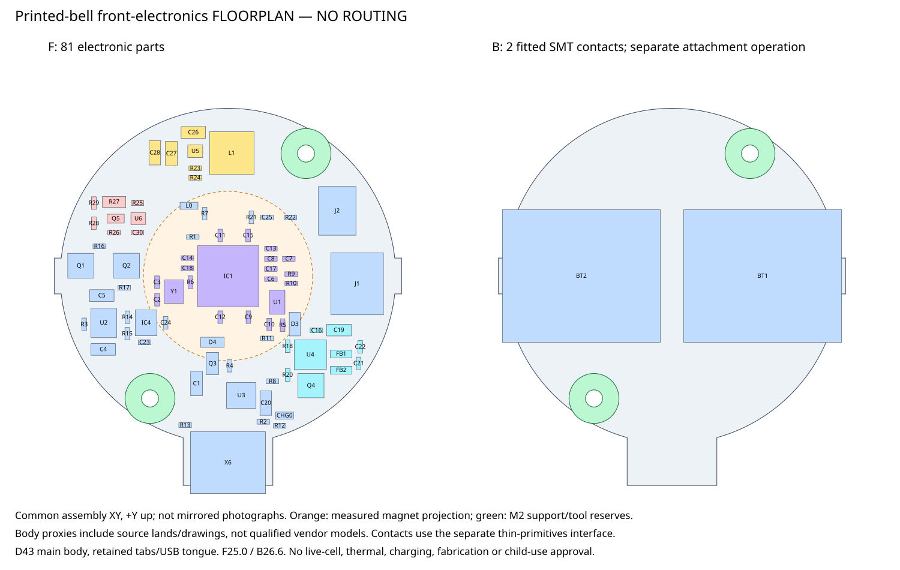

# Printed bell — front-electronics stage 1

**September 13, 2026: native electrical floorplan, deliberately unrouted.**
The D43 attempt fits without D46/D48 growth. There are **81 fitted electronic
parts on F and only the two fitted Keystone254 SMT contacts on B**.
This is not a single-operation reflow/assembly claim, an Economic-tier
qualification, a thermal result, or live-cell/fabrication permission.

Open `handbell.kicad_pro` with **KiCad10.0.6**. The circuit is the exact T8
schematic; its inherited title identifies that electrical source. Native
footprints are newly placed in this separate project. No earlier reference,
wing, T8 or print snapshot is regenerated.



## Review artifacts

| Artifact | What it establishes |
|---|---|
| `handbell.kicad_pcb`, `.kicad_sch`, `.kicad_pro` | Editable native floorplan, unchanged circuit and rules, two copper layers |
| [Schematic PDF](reports/handbell-schematic.pdf), [schematic SVG](reports/schematic-svg/handbell.svg) | Readable circuit including actual cell-protection section |
| [Front native PDF](reports/front-native.pdf), [back native PDF](reports/back-native.pdf) | Actual copper lands/drawings; value text omitted from plots only |
| [Front native SVG](reports/front-native.svg), [back native SVG](reports/back-native.svg) | Full native drawing exports; unfinished silk remains visible |
| [Schema-2 manifest](placement-manifest.json) | Exact body centers, native origins, angles, F/B transforms, Z bounds, substrate, USB and M2 interfaces |
| [Contact interface](battery-contact-interface.json) | Same thin contact primitives and lands, translated to the new assembly Z frame |
| [Correspondence report](reports/correspondence-review.json) | Final hashes, all325 physical pad comparisons, native results and measured CAD proximity |
| [Movement CSV](reports/footprint-movements.csv), [build report](placement-build-report.json) | All99 moved references, before/after native XY/angle/face and final electrical landmarks |
| [Master draft BOM](reports/bom-draft.csv) | 83 fitted,18 copper-only,C29 DNP,two board-only mounts; rear contacts remain assembly work |
| [Native bindings](reports/native-input-bindings.json) | Exact CLI version/hash, commands, source/local-library inputs and generated report bytes |
| [Raw input snapshot](design-input-snapshot.json), [source evidence](source-evidence.json) | Immutable dated inputs, inspected manufacturer document revisions/hashes and original source commits |

The `libraries` directory contains exact used source footprints, including
the corrected Q3/jumper definitions and actual T8 flash/protector/FET/contact
lands. `Handbell.kicad_sym`, `T8.kicad_sym` and local library tables make this
package independent of live project-relative footprint searches.

## Electrical choices, not just rectangle packing

All dimensions below are **actual CAD pad-to-pad straight lines**, not routed
trace lengths, measured hardware performance, or manufacturer distance limits.
The checker records explicit project floorplan bounds and verifies the
actual native pad locations rather than trusting placement prose.

- **RP2040:** power capacitors now surround the corresponding power-pin banks.
  The twelve supply pins have a matching-net capacitor1.238–2.441mm away.
  VREG_IN has its retained1uF C15 within2.633mm; VREG_OUT has1uF C8
  within1.594mm. C17 serves the adjacent USB/I/O supply pins48/49.
  Analog/reference and digital return layout, effective capacitance and
  power integrity still require routing/measurement review.
- **Flash and oscillator:** the actual **W25Q16JVUXIQ TR USON2x3/2MB** remains.
  QSPI clock pin separation is4.759mm; flash bypass C10 is1.130mm from its
  supply land. Y1, load capacitors and R6 remain a coherent left-side group:
  XIN–crystal4.664mm and XOUT–series resistor1.762mm. USB series resistors
  are grouped on the MCU side; their die-pin distances are4.306/4.591mm.
  No timing, oscillator stability or differential-impedance result is claimed.
- **TPS61023:** VIN capacitor C26, L1, U5, two output capacitors and feedback
  divider occupy a dedicated upper annular group. The SW–inductor land
  distance is2.455mm, VIN bypass1.986mm, nearest output capacitor3.776mm
  and FB upper/lower connections1.704/2.912mm. The checker also measures
  capacitor ground-return distances. The outer inductor is kept away from
  the MCU crystal/flash and retains its **full5mm** height.
  TI's short SW and rectifier/output-capacitor/ground loop guidance is an
  explicit routing constraint, not satisfied merely by short straight lines.
  Reserve a continuous protected-GND return beneath this group; keep the
  divider away from SW copper and connect its return quietly.
- **MAX98357A:** C16 is on the PVDD edge,1.611mm from its supply land;
  bulk C19 is2.437mm away. The output ferrites form two adjacent outward
  BTL paths,1.579/2.659mm from the amplifier lands. Their difference is
  visible, **not a matched routed pair**. Preserve both independent BTL nets,
  avoid routing either speaker output to GND, provide the retained thermal
  land's copper/thermal-via paths, and validate output filtering/EMI.
- **Cell protection:** actual U6 BQ29700, Q5 CSD83325L and33mohm R27 are
  retained with their true pin identifiers. C30 remains local to U6.
  Neither BT2/raw `CELL_NEG` nor the cell can may acquire a protected-GND
  bypass. Route the U6 sense return to the system side of R27 deliberately;
  do not let high-current copper replace a Kelvin-style sense connection.
- **Other circuitry:** regulator bypass, source selection, charger programming,
  audio switching and IMU bypass/pullups remain local functional groups.
  All retained logical nets, physical pad nets, values and package assignments
  are unchanged. X1 is absent, and no fuel gauge or speculative protection is added.

The seeded optimizer only relaxes these bounded local electrical groups and
secondary/service features; it does not freely interchange critical parts.
Every planning pair, including intracluster pairs, is screened. Native
DRC independently checks physical copper, mask, courtyard and library geometry.

## Immutable mechanical-consumer interface

Consume this package's exact manifest and contact hashes, not a reconstructed
D43 circle or a previous T8 approval. `reports/correspondence-review.json`
contains the four full SHA256 values.

| Interface | Released stage-1 datum, mm |
|---|---|
| Assembly origin | Exterior grille planez0; +Z toward handle |
| Speaker | Front4.5; basket rear16.5; magnet rear23.5; D40/H19 body, D21.70/H7 magnet |
| PCB | F25.0/B26.6;1.6 thick; main bodyD43; exactly retained outline points |
| Contact support tabs | x=±22.25 over y=±2.3; retain the actual polygon joins |
| USB tongue | x=±5.75; outer y=-26.85 |
| M2 mounts | (+10,+15.7),(-10,-15.7); drill2.2, GND padD4.4, support/tool keepout radius3.2 |
| USB native origin | (0,-22.82), native angle180° |
| USB body mouth | (0,-27.90); fab width8.94, body back y=-20.55; body Z21.5..25.0 |
| Contacts | BT1(+11.625,0) at0°; BT2(-11.625,0) at180°; B26.6 |
| Contact lands | x=±3.62, size4.24×5.2; x=±19.63, size4.24×3.3 |
| Cell | AxisX; nominal D16.4×L34; centerZ36.38=B+9.78; terminalsx±17 |
| Contact spring top | Nominalz43.19; full thin primitives remain in contact interface |
| Inductor/yoke | L1 Z20..25; supplied yoke top19.3; nominal axial gap0.7 |

USB **signal-ground** pins remain GND. Shell-anchor pads **M1–M4 remain
unassigned**, not silently grounded. Reserve their through-board anchor
projection on B and insulate/support the conductive shield independently.
The native USB origin, body mouth, mounts, contact datums and exact tab/tongue
outline did **not** require a change from the supplied initial XY targets.
J1/J2 and all component proxies must be taken from the final manifest.

The speaker collision screen uses a conservative stepped envelope: D40 up
to basket rearz16.5 and D21.70 up to magnet rearz23.5. All F proxies clear
it; parts reachingz23.5 are additionally kept outside a declared0.25mm
radial planning margin. That is an assumption, **not a measured tolerance**.
For components under the magnet, positive axial space remains explicitly
reported. The checker does not claim yoke geometry other than the supplied
top plane; the complete yoke/support/USB/service/cell-capture model must be
checked by the mechanical consumer.

## Native results and open gates

KiCad10.0.6 reports:

- **0ERC**.
- **237 physical DRC findings:** four inherited USB hole-clearance errors,
  103silk-over-copper,51silk-overlap,72text-height,2text-thickness and5silk-edge.
- **222 unconnected items:** no tracks, vias or zones exist.
- **46 inherited CLI parity fallback warnings**, with matched finding
  identities after face/position normalization. This is not a new GUI parity approval.
- No copper-clearance, mask-bridge, courtyard or library violations.

Every physical pad is compared before/after, including inverse B-to-F local
mirroring, KiCad10 local pad rotation, shape, mask/paste, drills and custom
polygon copper. There are325 pad records;322 have copper pad numbers.
USB findings have identical original pad identities, coordinates, actual
clearance and the unchanged0.25mm rule. Nothing is waived to make this pass.

**Routing has not started.** The next stage needs the parent's coordinated
mechanical-interface release: actual PCB support/mounts, USB plug and
withdrawal paths, battery capture/insulation and the exact manifest bind.
Do not regenerate this stage over manual routing; both scripts reject stale
evidence, and the generator refuses edited native/library/interface bytes.

The unchanged [T8 electrical handoff](../../../../docs/t8-electrical-revision.md)
still governs protection thresholds and limits. In particular:

- No automatic cell-temperature charge inhibit, charge safety timer or
  reverse-insertion electronics. The196mA nominal/14.7mA termination profile
  is **not** a qualified match to the supplied T8 cell.
- Q5/shunt fault transient survival, low-cell loud-note shutdown, hot-silicon
  current capacity, contact heating and source/USB insertion behavior remain open.
- Inductor, power capacitors, ferrites and speaker rating are not qualified
  by footprint names or proxy dimensions. No promised runtime, output power,
  final price or whole-BOM assembly tier.
- Rear SMT contacts remain real assembly operations; retention and positive
  contact/cell-can insulation are not solved by a plastic outer shell.
- Retain the documented LSM6DSOX Mode1 wiring and CircuitPython `CTRL9_XL`
  initialization gate before bring-up. An IMU does not prove chest contact.
- No purchase, fabrication submission, live-cell experiment or child-use approval.

## Reproduce

From repository root with existing Python and KiCad10.0.6:

```powershell
python .\tools\draft_printed_bell_placement.py
python .\tools\check_printed_bell_placement.py --run-native
python .\tools\check_printed_bell_placement.py
```

The default seed is13092026 with140000 bounded optimization steps, then a
feasibility-only finish. The source measurement/input is snapshotted as raw
JSON; later parent-owned status additions do not rewrite that historical
snapshot. Regeneration is intentional and may require a new mechanical bind.
Native runs use `reports\.native-run` inside this package, remove it when
finished, and bind ERC/DRC/netlist/SVG/PDF bytes plus all native source/local
libraries and generation/checking code. No OS temporary working directory,
Gerbers or fabrication files are part of this workflow.

## Attribution

Adapted hardware remains **CC BY-SA3.0 Unported**, with complete
[LICENSE.txt](LICENSE.txt) and [upstream notices](notices). Core5768 and
MiniBoost4654 credit **Limor Fried/Ladyada for Adafruit Industries**;
SOX4438 credits **Bryan Siepert for Adafruit Industries**. Pinned commits
and inspected manufacturer revisions are in [source evidence](source-evidence.json).

Original project code/explanations use MIT; KiCad standard library design
material uses its design exception. These do not relicense adapted hardware.
No manufacturer PDF, illustration, STEP model or supplied reference photo
is redistributed. This independent derivative is not endorsed by Adafruit,
TI, ST, Winbond, Keystone, Raspberry Pi or Analog Devices.
