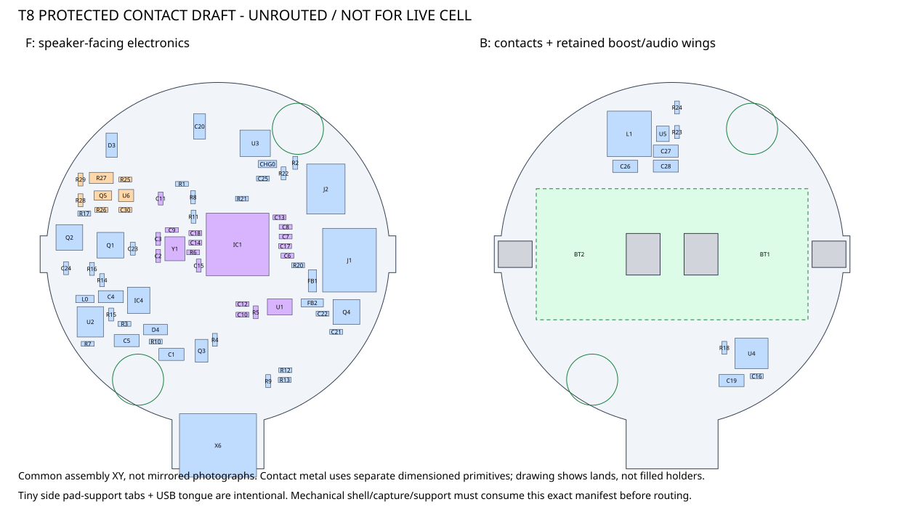

# T8 protected-contact placement draft

**2026-09-11: native schematic and complete new placement, deliberately
unrouted. Not for a live cell, fabrication, charging or child use.**

Open `handbell.kicad_pro` in **KiCad10.0.6**. Read the
[electrical revision](../../../../docs/t8-electrical-revision.md) for exact
pins, body-diode directions, protection thresholds/current tradeoffs,
source drawings and still-open temperature, reversal and charging gates.
This is separate from the frozen wing/reference/original projects.



## Delivered artifacts

| Artifact | Scope |
|---|---|
| `handbell.kicad_sch`, `handbell.kicad_pcb`, `handbell.kicad_pro` | Native editable circuit/placement;104 references,83 fitted (70F/13B) |
| `T8.kicad_sym`, `T8.pretty`, library tables | New USON2x3, protector/FET/shunt and SMT-contact implementations |
| [Schematic PDF](reports/handbell-schematic.pdf) | Human-readable export, including a dedicated protection section |
| [XML netlist](reports/handbell-netlist.xml), [BOM draft](reports/bom-draft.csv) | Actual pin/net and fitted/DNP/copper inventory; not an order-ready BOM |
| [Placement manifest](placement-manifest.json) | Schema2 mixed-face components, explicitZ, actual substrate outline, USB/mount interface |
| [Contact interface](battery-contact-interface.json) | Drawing-based land datums and original **thin** contact primitives, not solid collision boxes |
| [Frozen XY seed](placement-xy-seed.json), [stack-shift evidence](reports/stack-shift-screen-evidence.json) | Retained native poses and exact bounded mechanical selection; not a full-assembly approval |
| [Correspondence review](reports/correspondence-review.json) | Native inputs/reports byte-bound, unchanged-pin and actual-pad checks |
| [ERC](reports/erc.json), [DRC](reports/drc.json) | Complete findings retained, not hidden by waivers |
| [Source evidence](source-evidence.json) | Reviewed manufacturer document revisions/hashes; documents not redistributed |

U1 is **W25Q16JVUXIQ TR /2MB**, not4x4. The8-part protection block uses
**BQ29700DSER+CSD83325L+33mohm shunt**, with both charge and all-load returns
on protected GND. **Raw CELL_NEG must not be bonded to USB/system ground**.
Two **Keystone254revC** B-side contacts replace X1 completely.

The conservative overcurrent choice can trip below2A at low voltage/hot
silicon. It is not a promise of2A continuous delivery, a3A hard current clamp,
or a complete BMS. Reverse-cell protection and cell-temperature charging
inhibit are **not implemented**. The unchanged196mA/14.7mA charger profile
needs agreement with the exact T8 specification. Use inert fit models only.

**Selected fit alternative: the whole internal stack moves 6.25 mm toward
the mouth**, preserving relative speaker/component/cell gaps. A 1.0 mm
plastic guard with 0.10 mm nominal clearance gives 0.29406 mm external
guard-stock/shell clearance in the bounded mechanical BRep screen.
The requested 1.5/2.0 mm shifts failed because of the upper contact spring,
not the bare cell. No cell or metal geometry was clipped.
The complete mechanical assembly must rebind to this selected manifest;
this bounded result does not qualify tolerances or the positive clip's
independent can insulation. See the
[selected stack translation](../../../../docs/t8-electrical-revision.md#mechanical-coordination-selected-stack-translation).

## Shared mechanical interface

- Main bodyD43; Fz14.25/Bz15.85. Mounts(+10,+15.7),(-10,-15.7):
  2.2mm plated drills/4.4mm pads assignedGND,3.2mm local support/tool reserve.
- Local contact support tabs extend tox=±22.25 overy=±2.3.
- USB tongue isx=±5.75, outery=-26.85; retained **body mouth** is(0,-27.90),
  not the footprint center. Shell opening and repeatable load support required.
  This projects0.0445mm at the working shell's connector-midheight station,
  not across its entire flat mouth on a curved shell.
  USB signal ground is system GND; shell anchors X6.M1-M4 remain unassigned,
  with no reviewed shield bond. Insulate the shield as a conductive interface.
- Provisional34.0mm-total button-top T8 lies alongX; cell centerz25.63,
  springtopz32.44. Speakerfrontz=-6.25; the mechanical grille projects farther
  outside while the measured mouth register/shell attachment remain fixed.
  Maximum length/button geometry conflict, tolerances, loaded contact span,
  spring travel/current rating and qualified retention remain open.
- The FreeCAD assembly must consume this exact new manifest, including
  substrate tabs/tongue and thin contact geometry, before routing review.
  Existing wing mechanical approvals do not transfer.

## Native results

**0ERC**. There are244 physical DRC findings:240 unfinished silk/text and
the four inherited internal USB hole-clearance findings. **222 unconnected**
items reflect no routing. **46 known CLI parity fallback findings** remain
in the full report. There is no new GUI parity approval.

No copper-clearance, mask-bridge, courtyard or library findings remain.
The BQ29700 footprint deliberately uses an all-NSMD adaptation of the
manufacturer's exposed-land dimensions instead of copying its larger
left-side SMD copper. The unchanged0.20mm rule was not weakened; the
land/mask/stencil choice remains an assembler-review gate.

## Reproduce

From repository root, with Python and the installed KiCad:

```powershell
python .\tools\draft_t8_placement.py --preserve-xy --front-z 14.25 --usb-mouth-y -27.90 --guard-mm 1.0
python .\tools\check_t8_placement.py --run-native
python .\tools\check_t8_placement.py
```

The original placement's deterministic seed was163404. The selected update
uses **zero optimizer steps** and the immutable `placement-xy-seed.json`;
all non-USB native XY/angles/faces remain unchanged. Later runs automatically
retain that seed. Add `--preview` for a non-writing parameter screen.
The generator reads frozen wing sources but writes **only this variant**.
It refuses edited/untracked native
schematic/board bytes, routed boards, changed project settings and changed
previously recorded local libraries/interfaces. Preserve manual work and
update handoffs deliberately; do not run a frozen/original generator over it.

`--run-native` performs ERC, native netlist, parity DRC and PDF export in
`reports\.native-run`, then removes that staging directory and records
`native-input-bindings.json`. This location is inside this project, not an
OS temporary directory. Later checks reject stale CAD/dependencies,
changed report bytes or a mismatched manifest. The selected source-measurement
bytes, frozen XY seed and bounded stack-screen snapshot are also bound.
The fast electrical shell screen uses station chords; the mechanical BRep
uses its separately declared curved working profile. Manually invoking native
commands alone does not renew the evidence binding.

No Gerbers, routed copper, manufacturing order, purchase, firmware test or
physical battery-safety approval is provided.

## Attribution

The adapted hardware remains **CC BY-SA3.0 Unported**, not the root MIT
license: see [complete LICENSE](LICENSE.txt), [upstream notices](notices/)
and the [project attribution policy](../../../../ATTRIBUTION.md).
Core5768 and boost4654 credit **Limor Fried/Ladyada for Adafruit Industries**;
SOX4438 credits **Bryan Siepert for Adafruit Industries**. Their pinned
source revisions and full notices remain intact. This is an independent
dcuccia adaptation with AI assistance, not an Adafruit product/endorsement.

Standard KiCad mounting/recovery/library material uses its library design
exception. The new pads/symbols/contact primitives are original factual
implementations, not copied manufacturer CAD. Vendor PDFs, images and
STEP models are not redistributed. Original generation/checking code and
documentation use MIT; that does not change the adapted hardware's license.
