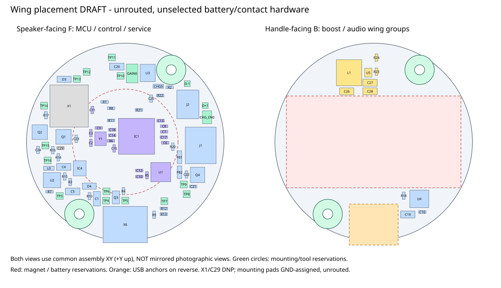

# Two-face wing placement draft

**2026-09-09: a separate, unrouted electromechanical iteration.**
Open `handbell.kicad_pro` in KiCad 10. The native schematic/board live beside
this file; their libraries resolve to the preserved parent/reference packages.
The original handbell project, September 7 print kit and measured-speaker study
are unchanged.



## What changed

The 43 mm board retains the existing circuit connectivity and part footprints.
It has **73 fitted components: 62 on F, facing the speaker; 11 on B, facing
the handle**. B contains the seven-part MiniBoost block and the four-part
amplifier/local-bypass block. The speaker connector and its output filter
remain on the speaker-facing outer annulus.

The old wired-battery connector X1 is **DNP in all three schematic units and
on the PCB**; C29 remains DNP. X1's footprint is retained as an unpopulated
provision, not a fitted 5 mm obstruction. No new contact footprint or reverse
insertion circuit is invented: battery/holder selection remains an electrical
freeze gate. This is not a complete, ready-to-power replacement battery input.

Two board-only plated M2 mounting footprints, MH1/MH2, are assigned to GND.
Their stock KiCad pads are **4.4 mm diameter with 2.2 mm drills**. They have
not become electrically grounded just by receiving a net name: the PCB still
has no tracks, vias or copper zones.

The 18 copper-only recovery/test/jumper features are on F and excluded from
the fitted BOM/placement-file inventory. They are principally board-out
bring-up access, not proven access through the assembled speaker/carrier.

## Shared mechanical interface

All dimensions are mm. The bell-opening plane is z0; +z points toward the
handle. F faces the speaker at z20.5; the 1.6 mm substrate ends at z22.1.

| Interface | Draft value |
|---|---|
| PCB | Diameter 43, thickness 1.6, front surface z20.5 |
| MH1 / MH2 centers | (+10, +15.7) / (-10, -15.7) |
| Hole copper / bore | Diameter 4.4 / plated drill 2.2, assigned GND |
| Support/head/tool reservation | Radius 3.2 about each mounting center on both faces |
| B-side battery/contact planning corridor | x=-19..19, y=-10..10; not a fitted holder envelope |
| B-side USB reservation | Center (0,-18), 10.64 x 8.93; USB body/drill projection plus 0.5 per edge |

`placement-manifest.json` is the schema-2 interface to the integrated-cartridge
study. Every fitted proxy has its actual side, center, rotation and explicit
z-min/z-max. Both diagram faces use **common assembly XY with +Y up**, not
mirrored photographs. Native KiCad coordinates are centered at (100,100);
for the speaker-facing F orientation, the common-frame rotation is the
negative native footprint angle.

**The USB's anchors extend through the PCB.** Initial placement under that
connector caused real rear-copper/drill conflicts, even though the SMT parts
were on opposite faces. The revised draft reserves that projection on B and
keeps the amplifier clear. Mating plug, actual anchor protrusion, slot,
insulation and cable/load-path dimensions still need review.

Mounting pads are not permission for metal fasteners to contact a cell can,
terminals or the bell. Support the PCB locally at fasteners and route
speaker/battery loads into the retaining structure, not through an unsupported
board or the IMU. Screw-head/washer size, shoulder/insert geometry, thread
engagement and bottom-out length remain explicit mechanical decisions.

## Electrical floorplanning versus geometric packing

The core starts from Adafruit 5768 relative placement. MCU, flash, crystal and
their fixed resistors retain their relative poses; local core capacitors are
translated by at most 1.2 mm before the cluster is placed, to remove crowded
courtyard relationships. The per-capacitor changes are recorded in the
manifest's local cluster frame.

The boost retains the pinned MiniBoost's internal placement as a rigid
seven-part block. Its source copper is **not copied**. This is a starting point
for short power loops and feedback separation, not a thermal/routing result.
The amplifier cluster explicitly moves C16 toward the transformed PVDD pads
7/8 and keeps bulk C19 adjacent instead of retaining the remote original
location. Other controls are still draft placements and need a routing-led
bypass/return-path review.

The planner reports zero inter-cluster envelope overlaps and zero current
boundary, mounting, battery-corridor or tall-front-part constraint violations.
Seven retained inflated planning-envelope overlaps remain within the boost
and fixed core relationships. These are not suppressed native DRC findings;
native copper, mask and courtyard results are recorded separately below.
Footprint-derived boxes/heights are not qualified manufacturer bodies.

## Native correspondence and remaining findings

[`reports/correspondence-review.json`](reports/correspondence-review.json)
binds the CAD, native reports and manifest. The source and candidate netlists
have identical pin/net connectivity, all 300 physical pads are accounted for,
and the project/rule settings are unchanged. Schematic changes are limited to
its title/revision and the consistent X1 DNP state.

| Native result | Disposition |
|---|---|
| ERC | 0 findings |
| Copper clearance, solder-mask bridge, courtyard and library issues | None in this candidate's native report |
| Physical DRC findings | 264 total: 116 silk-over-copper, 69 text-height, 68 silk-overlap, 4 hole-clearance, 4 silk-edge and 3 text-thickness |
| Four hole-clearance findings | The retained internal X6 USB geometry; still open, not waived |
| Unconnected items | 205; the board is intentionally unrouted |
| CLI schematic parity | 46 known auto-net/NC-pin fallback findings; complete records retained |

No paired-editor GUI parity review has been performed for this variant.
The baseline's GUI evidence must not be transferred to these changed files.
The independent pin/net/side/DNP checks and the known CLI limitation are not a
claim of fabrication, hardware, cell-safety or full routing approval.

## Reproduce and inspect

From the repository root:

```powershell
python .\tools\draft_wing_placement.py
python .\tools\check_wing_placement.py --run-native
python .\tools\check_wing_placement.py
```

The `--run-native` wrapper creates fresh reports in an isolated temporary
directory and binds their bytes to the exact schematic, board, project and
library tables. Later checks reject changed CAD or stale/modified reports.
Manually running a native command does not create that binding.

The deterministic placement defaults are seed163402 and160000 steps.
Regeneration takes time and refuses to overwrite routed or manually changed
candidate boards, edited schematics, project settings or library tables.
After a manual placement change, preserve the edited board
and update its mechanical/validation handoffs deliberately; do not work around
the overwrite guard. Do not run the original `place_handbell.py` to regenerate
this separate variant.

The next placement freeze depends on the
[integrated-cartridge study](../../../../mechanical/studies/2026-09-09-integrated-cartridge/README.md),
exact cell/contacts, complete speaker/USB envelopes and a priced assembly route.
JLC's published Economic tier is single-sided; Standard supports two-sided
placement, and the selected IMU's current listing is already Standard Only.
See the [dated capability/cost record](../../../../docs/electromechanical-wing-iteration.md#assembly-cost-is-a-decision-gate-not-a-reason-to-stop-drafting)
for the source links and required frame/panel assessment.
No Gerber, drill, order-ready BOM/CPL or fabrication order is issued here.
Inherited supplier-rotation fields are not approval of this variant's assembly
orientation; pin-1/side/rotation must be reconciled with the eventual JLC BOM/CPL.

## Attribution

The circuit and native PCB remain Adafruit 5768/4438/4654 derivatives under the
[parent hardware license](../../LICENSE.txt) and
[project attribution](../../../../ATTRIBUTION.md). The stock KiCad mounting
footprint is covered by the standard library's CC BY-SA 4.0 design exception.
Original generation/checking code is MIT; that does not relicense the adapted
electronics. No manufacturer 3D model, vendor photo or third-party print design
is copied into this draft.
