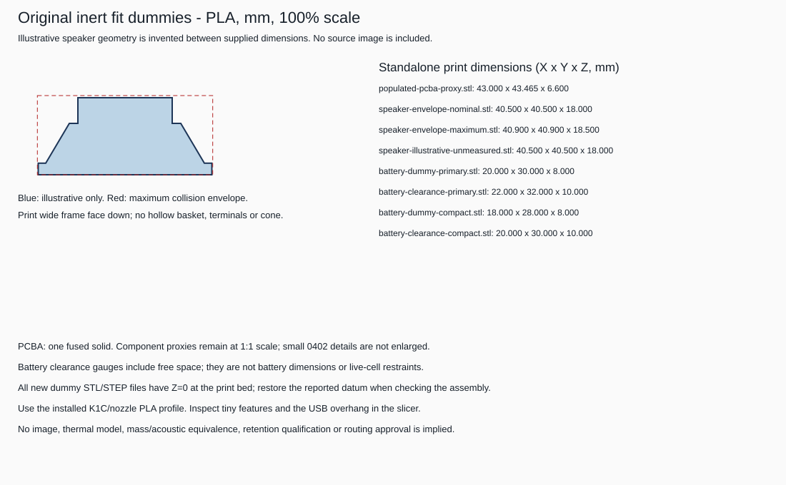

# Handbell mechanical feasibility artifacts

**September 9 update:** the arrived speaker measures 40 mm OD and **19 mm**
overall depth, with a D32 basket rear at z12 and D22 x H7 magnet. The
[separate measured-speaker study](studies/2026-09-09-measured-speaker/README.md)
records those stations, speaker-facing PCB conflicts, battery-space comparisons
and physical print feedback. The files below are the unchanged September 7
snapshot; its **18.5 mm speaker gauge is not deep enough for the measured part**.
No reinforced carrier or new battery holder has been released.

**Inert dimensional study, not a complete fitted assembly or child-use hardware.**
The editable FreeCAD document includes the current 74-part placement as rectangular
proxies, directly from the final supplied manifest with **no height overrides**.
J2 is SM02B side-entry at 3.1 mm; D3/D4 are 1.1/1.0 mm.
USB-to-shell interference and insufficient battery clearance are retained,
not hidden by cutting the shell or shrinking parts. See the
[quantitative handoff](../docs/mechanical-feasibility.md).
The [print-now dummy set](#print-now-inert-dummy-set) adds a connected fake
populated PCBA, speaker gauges and battery blocks for PLA fit work.

## Files and coordinate system

| File | Purpose |
|---|---|
| `handbell-feasibility.FCStd` | Native document with individually selectable BRep solids, Parameters spreadsheet, assumptions, source snapshot and placement snapshot |
| `handbell-assembly.step` | 82-solid assembly in the primary 74-component study; includes assumed shell and solid exterior-only handle, excludes construction cavity and battery clearance tools |
| `fit-carrier.stl` | Single connected baffle, speaker locating sleeve, three PCB seating rails and grille stand-offs; no positive speaker/PCB restraint |
| `bonded-interface.stl` | Separate shell mounting-ring fit gauge; adhesive/paint compatibility and retention unqualified |
| `grille.stl` | Separate grille fit gauge with matching alignment holes; cone excursion and acoustic performance unqualified |
| `parameters.json` | Explicit dimensions used for this run; editable regeneration input |
| `fit-report.json` | Per-component and scenario fits, material intersection volumes, battery alternatives, toolchain and artifact round-trip results/hashes |
| `fit-dummies.json` | Standalone dummy inventory, exact dimensions, print/assembly datums, assumptions and frozen placement hash |
| `freecad-build.log` | Local, Git-ignored diagnostics regenerated by the build; not part of the published download |
| `views/packaging-views.svg` | Original axial/proxy-plan illustration, not a photograph or manufacturer drawing |
| `views/fit-dummies.svg` | Original illustrative-speaker profile and print-dummy dimension inventory; no source image included |
| `README.md`, `LICENSE` | Usage, scope and original-work licensing |

All CAD coordinates represent **millimetres**. `z=0` is the bell opening,
positive z inward. PCB XY positions use the manifest's right-handed coordinates,
with positive rotations counterclockwise when viewed from +z toward the origin.
The SVG plan has +X right and +Y up. STEP declares millimetre SI units.
**STL has no unit metadata: import as mm at 1:1.**

The original carrier/interface/grille STLs retain assembly positions. Translate
them to the print bed rather than scaling: carrier z=-4, grille z=-5.8,
interface z=0. **All new standalone dummies below already start at print Z=0.**
Their print origin is not necessarily their position inside the bell.

## Print-now inert dummy set



**Start with** the [populated PCBA STL](populated-pcba-proxy.stl),
[maximum speaker gauge](speaker-envelope-maximum.stl), and
[compact battery-clearance gauge](battery-clearance-compact.stl).
The [illustrative speaker STL](speaker-illustrative-unmeasured.stl) shows the
approximate stepped shape, but is not the conservative fit envelope.
Use mm at 100%; the PCBA's extra USB projection must not be scaled away.
**No USB drilling/cutting template is supplied.** Its interference with an
uncut shell is expected; do not force it or use the proxy box as a connector
manufacturing drawing.

All dimensions in this table are default **millimetres**, at 100% scale.
Every listed STL is one connected, closed solid. Each has an editable BRep in
the native document's `FitDummies` group, separate from the assembly export.

| STL file | Size / purpose |
|---|---|
| `populated-pcba-proxy.stl` | **43 x 43.465 x 6.6** bounding box; 43 mm circular substrate, 1.6 mm thick, fused to all 74 supplied component boxes |
| `speaker-envelope-nominal.stl` | **D40.5 x H18** full cylinder; nominal frame/depth gauge |
| `speaker-envelope-maximum.stl` | **D40.9 x H18.5** full cylinder; conservative maximum frame/depth gauge |
| `speaker-illustrative-unmeasured.stl` | **D40.5 x H18** stepped rim, solid tapered basket and magnet; intermediate geometry is unmeasured |
| `battery-dummy-primary.stl` | **20 x 30 x 8** inert block, not a selected pack |
| `battery-dummy-compact.stl` | **18 x 28 x 8** inert block, not a selected pack |
| `battery-clearance-primary.stl` | **22 x 32 x 10** solid gauge representing the primary block plus 1 mm clearance on every face |
| `battery-clearance-compact.stl` | **20 x 30 x 10** solid gauge representing the compact block plus 1 mm clearance on every face |

The standalone **`populated-pcba-proxy.step`** and
**`speaker-illustrative-unmeasured.step`** have the same print orientation/datum
as their STLs. The PCBA is a true fused union, not a collection of disconnected
boxes. No small 0402 detail was enlarged, no bridging material added outside the
source envelopes, and no body clipped at the PCB boundary. The USB proxy explains
the 43.465 mm overall Y extent: do not scale the whole dummy down to 43 mm.
No visualization-enlargement variant is included.

For the current inward-facing board, put the PCBA's flat substrate underside on
the bed and components upward. Restore its bottom to **assembly z20** when
checking the bell; the print file itself has substrate z0..1.6 and components
through z6.6. Speaker gauges have the front/frame face on the bed and correspond
to assembly z0. Battery blocks correspond to **assembly z28**, while their
clearance gauges start at **z27** because they include the mouthward free space.
Use those depth datums rather than directly stacking all dummies against each
other; the model includes deliberate gaps between them.
The current model still predicts USB interference with an uncut shell and failure
of the larger battery-clearance gauge; do not force either into the bell.

### Speaker: supplied dimensions versus invented shape

The supplied retail image repeats frame40.5 +/-0.4, magnet22 +/-0.5, overall
depth18 +/-0.5 and rim2.7 +/-0.3 mm. It is **not redistributed**, embedded in
the native document, or traced for measurements. Rim height is part of overall
depth, not added to it. The maximum full cylinder remains the hard-interference
model; neither gauge includes unknown terminals, wire exits or cone excursion.

The separate illustrative dummy uses nominal frame40.5, depth18, magnet22 and
rim2.7. Its **37 mm basket front diameter**, **26 mm basket rear diameter** and
**magnet front at z12** are deliberately chosen, unmeasured starting values.
They imply a 9.3 mm tall solid conical basket and 6 mm magnet height. No rib
windows, terminals, diaphragm, recess or rear vent is claimed. A fit of this
illustrative shape is **not** evidence that the real basket fits.

Change the `gauge_speaker_assumed_*` values in `parameters.json` or the saved
Parameters spreadsheet, then regenerate. The compact battery has separate
`gauge_compact_battery_*` parameters. Its parameters also drive the corresponding
numeric clearance comparison. Older native spreadsheets receive the explicitly
logged new gauge defaults during regeneration.

### Creality K1C / PLA starting guidance

Use the K1C profile for the **nozzle actually installed**, with the filament's PLA
temperature settings. For a stock 0.4 mm nozzle, a reasonable unqualified starting
point is 0.20 mm layers for bulk gauges, 0.12-0.16 mm for the PCBA's small details,
three walls and 15-20% infill. These are starting suggestions, not an exercised
slicer profile; no G-code or remote print job is supplied.

Import **mm, 100% scale**, without fit-to-bed resizing. The wide speaker frame
face and battery block bottoms are already on Z=0 and are intended to print
without support. Inspect the PCBA's USB overhang and very small component boxes
in the slicer; add local support only if the actual toolpath requires it. Tiny
0402 proxy details can be lost, fragile or dimensionally inaccurate with a
0.4 mm nozzle. Check the toolpath rather than enlarging the exact-fit file.
The original carrier may require a different orientation/support strategy.

Let prints cool, then measure their diameters, depths and board thickness with
calipers before drawing fit conclusions. Remove loose fragments and do not
force a gauge against the painted shell. Follow the printer/filament guidance
for PLA ventilation and enclosure use. **PLA dummies are not live-cell
restraints, FR4/thermal substitutes, electrically functional parts, mass/acoustic
stand-ins, structural mounts or child-ready hardware.**

## Reproduce without opening a GUI

From the repository root, using ordinary Python and installed FreeCAD:

```powershell
$FreeCAD = "$env:LOCALAPPDATA\Programs\FreeCAD 1.1\bin\FreeCADCmd.exe"
python .\tools\build_mechanical.py --freecad-cmd $FreeCAD --placement .\hardware\handbell\placement\placement-manifest.json
```

The launcher runs the installed FreeCAD Python interpreter, not an unrelated pip
package. It uses temporary isolated user/system preferences, waits synchronously,
and checks a fresh completion marker because FreeCAD's console can return zero
after a Python exception. The console process has a **300-second timeout**.
No GUI, background detachment, add-on installation,
user-window manipulation or shared FreeCAD-preference changes are required.

The script regenerates the named CAD/data/view artifacts in this directory.
It never writes the placement manifest, KiCad files or existing documentation.
It overwrites its generated outputs, so use `--output` with another directory
to preserve a study. A successful build means artifacts were generated and
round-tripped, **not** that all geometry fits.

To modify a parameter without editing code, use `--parameters` with a JSON
object containing known keys, or edit the native `Parameters` spreadsheet,
save the document, then regenerate:

```powershell
python .\tools\build_mechanical.py --freecad-cmd $FreeCAD --parameters-from .\mechanical\handbell-feasibility.FCStd --placement .\hardware\handbell\placement\placement-manifest.json
```

The BReps are source-generated features, not a fully constrained interactive
feature history. **Spreadsheet edits alone do not rebuild geometry.** The command
above reads those saved values and rebuilds the model. Manifest board dimensions
and face take precedence over parameter-file/spreadsheet board values.
`--speaker-front-z 1` moves the speaker front to z=1, with unchanged full depth.
The script snapshot inside the document records the source that built it.

`--component-height REFERENCE=MM` is an explicit model-only parameter: it changes
neither the input manifest nor the component's XY, footprint or rotation.
`--component-height-note` records its reason. If explicitly requested, original
and effective heights are recorded in `fit-report.json` and native
`ComponentHeightOverrides`; the native manifest snapshot remains unchanged.
`--parameters-from` does not restore such overrides automatically.
**No height override is used or needed for the current supplied manifest.**
The earlier top-entry height screen and its J2/battery-clearance overlaps are
superseded. The current side-entry J2 does not intersect either battery
alternative's clearance envelope.

The report distinguishes `required_shell_cutouts` from
`unplanned_cavity_conflicts` while retaining raw uncut-shell intersections.
No USB slot is implemented or dimensionally qualified. The 18 reverse-face
copper features and C29 DNP reservation remain metadata, not material solids.
Battery variants include their intersections with populated-board proxies:
cavity containment alone does not establish assembly clearance.

When first opening the headless-produced document in FreeCAD, hide
`CavityReference` and `BatteryClearance` under the construction-reference group;
their solid geometry is for calculations, not physical parts. Also hide the
`FitDummies` group: its independent print-coordinate objects overlap when shown
together and are deliberately excluded from `handbell-assembly.step`.
Hide `BellShell` and `HandleExterior` to inspect the electronics/carrier.
Show one dummy at a time to inspect it, or open its standalone STEP.
The original SVGs are ready-to-view illustrations without display setup.

Passing `--placement` with a missing or malformed file is an error. Omitting it
deliberately produces a **placeholder-only** study with no component solids;
it does not silently load a nearby manifest or reuse old placement data.

## Attribution and license boundaries

The original mechanical primitives, fit-print designs, parameters, program and
new documentation are explicitly available under the [MIT license](LICENSE).
They are independent geometry built from the declared dimensions and assumptions.
No vendor photograph, owner photograph, manufacturer STEP model, speaker drawing,
upstream board solid, KiCad library geometry or third-party mesh is copied here.
The illustration is generated from this original model.

**Do not label the populated study blanket-MIT.** The embedded placement snapshot,
component-reference context and adapted electronics remain subject to the
repository's [attribution policy](../ATTRIBUTION.md) and the
[handbell hardware's CC BY-SA 3.0 notices](../hardware/handbell/README.md).
The mixed populated FCStd/STEP, populated-PCBA STEP/STL, placement-based views
and reports must travel with
those notices; the original mechanical geometry's separate MIT grant does not
relicense the electronics. The embedded script retains MIT independently.

The referenced electronics are based on:

- **Limor Fried/Ladyada for Adafruit Industries**, RP2040 Prop-Maker Feather
  5768, revision `408fa9a40c0a01a3a65497ef42a29e0b08fe711e`;
  [source notices and full CC BY-SA 3.0 license](../hardware/reference/adafruit-5768/README.md).
- **Bryan Siepert for Adafruit Industries**, LSM6DSOX 4438,
  revision `c05abef4675b0380fbf3d23171615a2f1ac0b130`;
  [source notices and full license](../hardware/reference/adafruit-4438/README.md).
- **Limor Fried/Ladyada for Adafruit Industries**, TPS61023 MiniBoost 4654,
  revision `82b5a33a1900a5c13849029bc84e7856a44086e0`;
  [source notices and full license](../hardware/reference/adafruit-4654/README.md).

Distribute this study with the repository's complete upstream notices, or carry
those notices/licenses alongside standalone populated exports. These proxy boxes
are not Adafruit or component-manufacturer CAD models. Attribution does not imply
endorsement, manufacture or mechanical/electrical/safety qualification.
