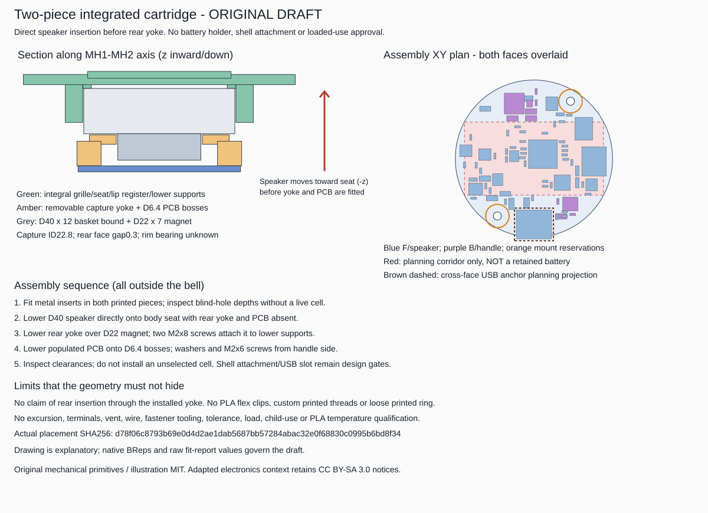

# Integrated cartridge - two-piece mechanical draft

**An original, implemented fit/structural concept, not a complete retained
battery assembly or a qualified instrument.** The former separate grille,
speaker seat and lower supports become one printed body. One removable
capture yoke carries the PCB and closes the speaker-loading opening.
There are **two primary printed structural pieces**, four ordinary M2 screw
placeholders, four metal insert placeholders and two PCB washers.

The speaker can be inserted directly from the rear **before the yoke and PCB
are installed**. No claim is made that a D40 speaker passes through the
installed D22.8 capture opening. The yoke is intentionally removable rather
than a thin flex clip. No cell retainer is supplied or qualified.



## Delivered artifacts

| File | Purpose |
|---|---|
| `integrated-cartridge-draft.FCStd` | Native selectable BReps, individual F/B component envelopes, full alternative battery bodies, Parameters record and embedded builder/helper/input source snapshots |
| `integrated-cartridge-assembly.step` | Body, removable yoke, conditional speaker body, fused populated PCB and metal hardware placeholders; no unselected battery or assumed shell in this assembly |
| `INERT-integrated-grille-seat-body.stl` | First primary structural piece: integral grille, annular front seat, lip register and opposed lower supports |
| `INERT-removable-capture-yoke.stl` | Second primary structural piece: rear capture ring, screw ears and locally supporting PCB bosses |
| `populated-wing-pcba-proxy.step`, `INERT-populated-wing-pcba-proxy.stl` | Single connected substrate-plus-73-component union with both 2.2 mm mounting drills; no enlarged components or extra bridging material |
| `INERT-measured-speaker-body-screen.stl` | Optional fit dummy, not an additional structural piece; D40 through z12 plus D22 magnet through z19 |
| `placement-snapshot.json` | Exact consumed schema-2 bytes, not a rewritten approximation |
| `parameters.json` | Dimensional record of this build, not a stand-alone regeneration input |
| `shell-parameters-snapshot.json` | Frozen baseline shell parameters consumed by the reused profile helper |
| `fit-report.json` | Raw BRep intersections/distances, insertion sweeps/samples, battery failures, hardware stacks and round-trip results |
| `artifact-manifest.json`, `completion.json` | Input/output SHA-256 records and a fresh run-specific completion token |
| `review-status.json` | Export-hold status; cleared only after the regenerated CAD and reports reach successful completion |
| `integrated-cartridge-views.svg` | Original explanatory section and common-XY two-face plan; not vendor artwork |
| `freecad-build.log` | Local console diagnostics, Git-ignored; no GUI was launched |

All coordinates are **mm**, with opening z0 and +z inward. CAD/STL objects
retain assembly coordinates. **Do not scale these files to fit.** Translate
to a print bed only when preparing an inert sample: the body starts at z-4.5,
yoke at z9, PCBA components at z17 and speaker at z0. The two-sided PCBA proxy
has no full flat board face to put directly on the bed; its printing orientation,
supports and small-feature reproduction require separate consideration.
No G-code, print job or fabrication package is supplied.

## Frozen interface and actual input

The board is D43 x 1.6, F substrate face z20.5 toward the speaker and B face
z22.1 toward the handle. Component XY, rotation, footprint, side, dimensions
and explicit z bounds are consumed without adjustment. There are 62 F and
11 B fitted proxies.

MH1 is (+10,+15.7), MH2 (-10,-15.7). The **actual supplied manifest has 4.4 mm
pad diameters**, rather than the initial 4.2 mm planning value. Both drills
remain 2.2 mm, GND-assigned, with 3.2 mm-radius reservations on both faces.
The yoke's D6.4 PCB bosses stay inside those reservations; this builder does
not alter the PCB, pads, nets or source manifest. GND assignment is not
electrical connection on an unrouted board.

Consumed placement SHA-256:
`d78f06c8793b69e0d4d2ae1dab5687bb57284abac32e0f68830c0995b6bd8f34`.
The input section of `fit-report.json` also records the manifest's electrical
PCB/schematic hashes and the frozen helper hash. The old print artifacts and
measured-speaker study are not regenerated.

## Geometry and mechanical load paths

| Feature | Draft dimensions / meaning |
|---|---|
| Integrated body | D72 outer flange, z-4.5..9; 2.7 mm annular plate with 1 mm axial grille-root overlap; D69 lip register z-1..2 inside assumed ID70 mouth |
| Speaker front seat | D36 aperture, outer D40.4, top z0; actual rim bearing width is unknown |
| Grille | 1.8 mm web, z-4.5..-2.7, nominal 2.8 mm slots on 4 mm pitch; no excursion/acoustic approval |
| Opposed lower supports | Radius22.6 on MH radial axis, 4.6 radial x 7 tangential, ending at z9; clear basket passage D40.6 |
| Capture yoke | Ring ID22.8 / OD37, z12.3..14.8; wider 8 mm screw ears, PCB bosses D6.4 ending at z20.5 |
| Lower fasteners | Two M2x8 placeholders, shanks z3.5..11.5, heads D3.8 x H2 at z11.5..13.5; inserts D3 x L4 at z5..9 |
| PCB fasteners | Two M2x6 placeholders, shanks z16.4..22.4; D4 x 0.3 washers at z22.1..22.4; heads through z24.4; inserts z16.5..20.5 |

PCB clamping passes through each washer, locally supported substrate and
yoke boss, then through the capture arms and the two lower M2 joints into
the integrated body. The speaker bears on the front seat, with the removable
yoke limiting rearward/lateral movement. Its loads need not pass through an
unsupported PCB, solder joint or battery contact.

The lower fastener pockets leave nominal 0.8 mm radial plastic walls and
1.95 mm tangential ligaments around the head counterbores. These are
geometrical dimensions, **not** insert-installation or pullout approval.
Nominal thread-engagement envelopes are 4 mm; screw-tip to blind-hole-bottom
gaps are 0.3 mm below and 0.6 mm at the PCB. Real screw tolerances, insert
knurls, installation tools, torque, washer finish, layer orientation, creep
and local IMU stress remain gates. The model uses smooth metal placeholders,
not printed/custom helical threads. No fastener penetrates the central
battery planning corridor; actual electrical insulation is still required.

The integral D69 lip register **locates but does not attach** the cartridge
to the shell. The D72 flange deliberately remains outside the mouth.
Adhesive/paint compatibility, a positive shell attachment and insertion/USB
loads into that attachment are unresolved. There is no invented handle
interior, concealed bonded mounting ring or third structural print.

## Exact assembly sequence and evidence

1. Outside the bell, inspect both inert prints and install the selected metal inserts only after resolving their actual installation dimensions. Keep all live cells absent.
2. With the yoke, PCB and screws absent, lower the speaker axially, front-first, until its front rim reaches the z0 seat. The lower supports leave a D40.6 passage for the D40 body.
3. Lower the yoke over the D22 magnet, onto the two lower support tops. Install the two M2x8 screws from the handle side before fitting the PCB.
4. Lower the populated PCB onto the two D6.4 bosses. Add the two washers and M2x6 screws from the handle side. Support the board locally; do not use torque to pull a warped PCB flat.
5. Inspect the remaining access/clearance gates. Do not install an unselected cell or treat the lip register as secure shell attachment. Reverse the order for speaker service.

`assembly_paths` contains an exact swept union of the stepped speaker for
50 mm axial travel and 26 pose samples, checked against the integrated body.
It contains conservative yoke translation bounds for 40 mm travel plus
21 poses against the seated speaker/body, and a 30 mm conservative populated
PCBA sweep against installed lower hardware and structure. These paths have
zero modeled material intersection at the supplied input. Intended bearing
contacts have zero distance; that does not mean interference.

The wrong sequence is also recorded: attempting rear axial speaker insertion
with the yoke installed produces a large swept collision. Positive stop
probes show intersections for 0.5 mm axial displacement and eight 1 mm lateral
displacements, rather than relying solely on gravity. These are rigid-body
stop probes, **not** proof of all possible tilted escape paths, sufficient
retention strength or a suitable bearing surface on the real driver.

The stepped D40 z0..12 + D22 z12..19 speaker is a **conditional body screen**.
The straight D40-to-D32 basket in the native file is only illustrative.
The real rim, intermediate basket, terminals, wire exit, rear vent, excursion
and dimensional tolerances are unknown. In particular, a measured D32 rear
basket station does not establish that the capture annulus may safely bear
there. The 0.3 mm axial gap and 0.4 mm radial magnet gap are assumptions.
The speaker-front z0 placement is also assumed.

## Retained fit findings and battery blockers

There are no speaker/component or yoke/component material intersections in
the supplied 73-part screen. Minimum component-to-speaker separation is
**0.5 mm**. The closest component-to-yoke gap is only **0.254 mm at U3**;
this is not a tolerance, vibration or IMU-stress allowance.
The yoke clears the assumed shell by only **0.263 mm**, and the lower screw
heads by **0.354 mm**. These small nominal distances do not establish usable
manufacturing or real-shell clearance.

X6 remains `required_not_implemented` for a shell access cutout even though
its new F-side body proxy has **0 mm3 raw uncut-shell intersection**.
Its full bounds are x-4.82..4.82, y-21.965..-14.035, z17..20.5.
Do not interpret a contained connector box as an accessible USB port.
Plug/cable travel, through-board anchors, connector support, insulation and
a manufacturable cutout remain unresolved; no shell material is silently cut.

The manifest's **10.64 x 8.93 mm B-side USB projection**, centered at
(0,-18), is screened separately against B components, structure, hardware,
the optional floor and every battery alternative. Its native construction
prism extends z22.1..43 conservatively because the anchor height is unknown:
**43 mm is the assumed cavity-depth limit, not a claimed anchor height.**
It is not fused into the PCBA or included as material in the assembly STEP.
Individual USB anchor/solder volumes and PTH/NPTH holes are not supplied as
3D primitives; the PCBA dummy is not a gauge for those omitted details.
Raw overlaps and distances are in `cross_face_reservations`, separate from
actual material collisions and the required shell access cutout.

Battery bodies are **not** shrunk or clipped. Cylindrical axes are X; pouch
long dimensions are also X to match the central x+/-19, y+/-10 planning
corridor. The alternatives are mutually exclusive native reference bodies,
not installed objects in the STEP assembly.

| Full bare body | Bottom z23.1: 1 mm above PCB | Bottom z24.6: illustrative floor/contact lift |
|---|---|---|
| Protected 16340 example, D16.8 x L34 | About 0.43 mm shell distance | About 0.04 mm shell distance |
| Fenix ARB-L16-700UP published D16.8 x L35.5 | About 1.37 mm3 outside cavity | About 16.48 mm3 outside cavity |
| Pouch 28X x 18Y x 8Z | About 3.41 mm shell distance | About 3.02 mm shell distance |
| Pouch 30X x 20Y x 8Z | About 2.07 mm shell distance | About 1.69 mm shell distance |

An **unattached** 38 x 20 x 1.5 floor sensitivity is modeled in full at
z22.6..24.1, with cell bottom z24.6 leaving 0.5 mm above it. It is not a
printed part, a load-bearing connection or an implemented cradle. The full
cells move with the lift; no original cell underside is retained by clipping.
Uniform 0.5 and 1 mm envelope sensitivities are also reported.

With 0.5 mm clearance, even the shorter cylindrical example has about
1.19 mm3 outside the cavity at the no-floor position, rising to about
14.58 mm3 after lift. The larger pouch's 0.5 mm envelope at z23.1 intersects
the populated PCB by about 2.23 mm3, despite clearing the shell. The raw
failures remain in the report.

**No complete battery retainer fits by declaration here.** There are no end
stops, independent top capture, contact travel model, wrapper-safe supports
or selected cell/insulation system. Contacts must not be structural restraint;
a bare floor cannot replace cell protection. The compact example's current
capability is unqualified; the Fenix published 2.5 A claim does not solve its
longer body's mechanical interference or unspecified tolerances. No live-cell,
child-use, PLA temperature, shake, drop or electrical qualification is implied.

## Reproduction and source editing

From `C:\Projects\dcuccia\digital-handbell`:

```powershell
$FreeCAD = "$env:LOCALAPPDATA\Programs\FreeCAD 1.1\bin\FreeCADCmd.exe"
python .\tools\build_integrated_cartridge.py --freecad-cmd $FreeCAD --placement .\hardware\handbell\iterations\wing-draft\placement-manifest.json
```

The exercised toolchain is FreeCAD **1.1.3**, OpenCASCADE **7.8.1**, bundled
Python **3.11.14**. No new packages or GUI are used. `--placement` is required;
schema, dimensions, faces, z bounds, hole interfaces and electrical hashes
are checked. There is no fallback to the old placement. Missing or invalid
input fails, and a unique completion token prevents FreeCAD's interactive
console returning zero after a Python exception from looking successful.

STEP is exported before tessellation so OpenCASCADE's mesh-cached bounding
boxes cannot contaminate the exact STEP-bound comparison. STEP is reopened
for solid-count, volume, bounds and mm-unit checks. Each STL is reimported
as a single closed manifold mesh and reconstructed BRep; FCStd is reopened
and its solids/source records checked.

Native solids can be inspected/edited in FreeCAD; the source snapshots
describe their construction. For reproducible changes, edit the **new**
builder's geometry and dimensional record together, then rerun. The
Parameters spreadsheet is a record, not a live expression-driven model;
editing it alone does not recompute the BReps. Hide the assumed shell,
individual proxy group, cross-face planning reservations and unselected
battery/reference objects when viewing only the assembly. The historical
`tools\build_mechanical.py` is imported
unchanged and enforced against its frozen SHA-256.

## Original work and retained electronics context

Original mechanical primitives, this illustration, documentation and the
new builder are MIT under [the mechanical license](../../LICENSE).
No third-party printed design, manufacturer CAD, vendor photograph or image
was copied. The mixed assembly/PCBA context retains the adapted electronics'
**CC BY-SA 3.0** scope; it is not relicensed MIT merely by using simple boxes.
See [mechanical attribution](../../README.md),
[handbell notices](../../../hardware/handbell/README.md) and
[project attribution](../../../ATTRIBUTION.md), including the source notices
for Limor Fried/Ladyada and Adafruit Industries, and Bryan Siepert for
Adafruit Industries for the SOX hardware. Attribution does not imply endorsement.
