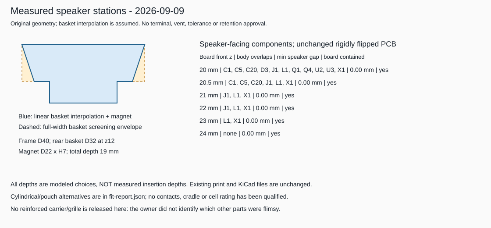

# Measured speaker stations and battery-space screen

**2026-09-09: a separate study, not a replacement print kit or fitted layout.**
The speaker arrived, and the owner supplied physical dimensions. The existing
populated-PCBA print worked and could enter the bell relatively deeply, but no
insertion depth/orientation was measured. Some other printed parts were flimsy;
which parts and failure locations were not specified.

The original KiCad files, placement manifest, mechanical generator and
September 7 print artifacts are unchanged. No strengthened carrier, battery
holder or routed PCB is delivered by this study.

## What was measured

| Dimension | Owner report |
|---|---:|
| Front/frame outside diameter | 40 mm |
| Front face to back of magnet | 19 mm |
| Front face to basket rear / first ridge | 12 mm |
| Basket rear outside diameter | 32 mm |
| Magnet height | 7 mm |
| Magnet outside diameter | 22 mm |

The axial reports agree: 12 + 7 = 19 mm. Measurement uncertainty, sample count,
front-rim thickness, intermediate basket profile, terminals, wire exits, rear
vent and cone excursion remain unspecified. These are measurements of the
arrived part, not manufacturing maximum dimensions.

**The old 18.5 mm-deep speaker gauge is now too short for the reported part.**
Keep that file as the original study, not as the current conservative fit gauge.
No previously printed PCBA needs to be rescaled because of this measurement.

## Files



| File | Meaning |
|---|---|
| `speaker-interpolated-stations.step` / `.stl` | D40 to D32 straight basket taper over 12 mm, plus D22 x H7 magnet; interpolation is assumed |
| `speaker-stepped-body-envelope.step` / `.stl` | D40 x H12 basket cylinder plus D22 x H7 magnet; leaves the entire basket width occupied instead of trusting a straight taper |
| `speaker-full-body-cylinder.step` / `.stl` | D40 x H19 full-body cylinder; ignores the available space around the magnet |
| `outward-body-screen.step` | Speaker stepped envelope and original populated board at the report's display depth; no carrier, contacts or battery included |
| `measured-speaker-study.FCStd` | Native BRep features, alternative battery bodies, measured-station spreadsheet, source and input snapshots |
| `fit-report.json` | All six board-depth screens, component conflicts, battery/clearance comparisons, artifact evidence and limitations |
| `measurements-snapshot.json`, `placement-snapshot.json`, `shell-parameters-snapshot.json` | Logical input snapshots for this dated screen |
| `measured-speaker-screen.svg` | Original drawing; no vendor/user photos used |

The three speaker STLs start with the speaker front on print Z=0. Import in
**millimetres at 100% scale**; STEP declares mm, whereas STL has no units.
These are inert solids, not acoustic models. There is no need to print another
speaker dummy now that the physical speaker is available.

The stepped shape is a **conditional body envelope**, not a tolerance or
terminal/vent envelope. It assumes all basket material is within D40 at z0..12
and the rear body within D22 at z12..19. Unmeasured projections can invalidate
that bound. The straight taper is a visualization alternative, not the
authority for collision clearance.

Open the native document with the full-cylinder and interpolated speaker
alternatives hidden, and show only one battery alternative at a time. Hide
`AssumedShell` to inspect the electronics. The `AssemblyDisplay` group is the
STEP assembly. Spreadsheet/source snapshots document the construction;
editing a spreadsheet cell alone does not rebuild these generated features.
Edit the measurement input and regenerate instead.

## Current placement does not become a fit merely by flipping

The shell remains the previous **assumed** profile: D50 at z13 tapering to D34
at z43, with the adjustable near-mouth transition. The speaker front remains
at bell-opening z0. PCB-front depth is the opening-facing substrate surface;
the substrate is 1.6 mm thick and components face the speaker.

The 74 component proxies are rigidly flipped 180 degrees about X, including
their Y coordinates and in-plane rotations. Their dimensions, footprints and
heights are unchanged; this is not an electrical re-placement. The simple
depth sweep produces:

| PCB front depth | Proxies overlapping stepped speaker body |
|---|---|
| z20 | C1, C5, C20, D3, J1, L1, Q1, Q4, U2, U3, X1 |
| z20.5 | C1, C5, C20, J1, L1, X1 |
| z21 | J1, L1, X1 |
| z22 | J1, L1, X1 |
| z23 | L1, X1 |
| z24 | None with positive volume, but L1/X1 touch the magnet rear plane |

All six substrates fit the assumed cavity without their mounting hardware.
**None meets even the illustrative 0.5 mm nominal speaker-body-gap screen.**
`selected_screen_depth_mm` is therefore null; `display_depth_mm` is explicitly
z20, an intersecting reference configuration, not a successful alternative.
The STEP/native assembly must not be mistaken for an approved fit.

For these depths, the interpolated basket and stepped basket produce the same
component conflicts: the measured rear magnet and component heights dominate.
This is useful direction for the next actual electrical floorplan:

- L1 is the boost inductor with a provisional 5 mm height; relocate the power
  block coherently rather than moving just the inductor away from its capacitors.
- X1 is the original wired-battery connector, also screened at 5 mm. A committed
  wire-free contact design would remove/replace that branch, not retain both
  connectors by default. It remains in this unchanged-baseline comparison.
- J1 is the speaker connector. Its body/mated/lead envelope must clear the
  magnet and remain accessible; the current proxy is not a qualified mated model.
- Lower parts near the magnet still need explicit vertical/radial clearance,
  vent access and routing/return-plane space.

Moving the entire PCB toward the handle to dodge tall parts reduces battery
space. The successful bare-PCBA print does not prove that speaker, battery,
contacts and carrier fit simultaneously.

## Keep battery alternatives open

For comparison, each cell body starts **1 mm above the handle-facing PCB
surface**. This is an assumption, not a real contact's installed height.
The report evaluates bare bodies plus uniform 0.5 and 1 mm clearance envelopes.
Those envelopes are sensitivities, not substitutes for spring travel, clip
geometry, electrical insulation, pouch expansion, leads or a capture cradle.

| Body / clearance comparison | Board at z20 | Board at z22 | Board at z24 |
|---|---|---|---|
| D16.8 x L34 compact 16340 body only | Fits; about 0.56 mm distance to shell | Fits; about 0.04 mm | Interferes |
| Same 16340 plus 1 mm uniform clearance | Interferes | Interferes | Interferes |
| Fenix ARB-L16-700UP published D16.8 x L35.5 body only | Slight interference (about 0.21 mm3) | Interferes | Interferes |
| Nominal D18 x L35 18350 body only | Interferes | Interferes | Interferes |
| 18 x 28 x 8 pouch placeholder plus 1 mm each face | Fits; about 1.94 mm to shell | Fits; about 1.43 mm | Fits; about 0.91 mm |
| 20 x 30 x 8 pouch placeholder plus 1 mm each face | Fits; about 0.60 mm to shell | Fits; about 0.09 mm | Interferes |

Distances here are shortest BRep distances to the modeled shell, not the
slightly different horizontal radial distances in the earlier analytic screen.
Rounded positive values are not allocated assembly tolerance. These rows only
describe battery-space comparisons; their corresponding board depths still
have the speaker conflicts above.

The compact 16340 size example comes from [KeepPower's RCR123A 800 mAh page](https://www.keeppower.com.cn/products_detail.php?id=635);
its required current capability is not qualified. The 18350 is a nominal
size-only example, **not** a protected/button-top maximum. Neither pouch
placeholder identifies a purchasable pack, capacity or discharge rating.

The Fenix ARB-L16-700UP is a separate, sourced higher-current candidate with
published 2.5 A stable output; it is **not** the smaller KeepPower envelope.
Its extra 1.5 mm length causes nominal interference even at z20 with the assumed
1 mm standoff. This does not prove it cannot fit a revised stack or the real
shell; it shows why cell/contact selection and PCB placement must be evaluated
together. No complete holder or terminal-charging approval is implied.

Keep both compact protected 16340 and suitably rated flat-pouch options active.
Screen actual cells for the existing >=2 A continuous plus transient-margin
target, cell-specific 4.2 V Li-ion charging and protection. Actual clip/cradle
height may eliminate the slim 16340 body-only margin. See the
[contact research](../../../docs/battery-contact-options.md) for sourced leads
and the limits of interpreting a CR123A holder designation.

## Flimsy parts: unresolved structural work, not a reprint request

The owner did not identify which other pieces were flimsy. The prior carrier's
long 1.2 x 2.5 mm rails, 0.8 mm seating tabs, 1.8 mm grille and unqualified
fastening scheme are review targets, **not identified failures**.

The next carrier should use short supported load paths, ribs/webs where the
actual cavity permits, positive PCB/speaker capture, a supported USB interface
and independent cell restraint. Compare ribbed/integrated cartridge geometry
against thin free-standing rails. More infill alone does not increase a thin
member's external section. Blindly thickening everything can lose the small
existing taper clearance, so no replacement carrier is issued yet.

Record the weak part names, failure locations, slicer orientation and measured
PCB insertion depth before changing the retaining structure. The existing
PLA prints are not qualified live-cell restraints or child-use hardware.

## Reproduce without changing the original print kit

From the repository root:

```powershell
python .\tools\screen_measured_speaker.py --freecad-cmd "$env:LOCALAPPDATA\Programs\FreeCAD 1.1\bin\FreeCADCmd.exe"
```

The default output is this dated subdirectory. The separate launcher uses
isolated temporary FreeCAD preferences, a 300-second timeout and a fresh
completion marker; there is no GUI, persistent background job or package install.
Its local `freecad-build.log` is Git-ignored.

To use this study's saved inputs, pass `--measurements`, `--placement` and
`--shell-parameters` with the corresponding snapshot files, and `--output` with
a different directory. The generator reuses the frozen original geometry
helpers but does not regenerate or modify the original print kit.

Original code and mechanical primitives are MIT-licensed under
[mechanical/LICENSE](../../LICENSE). Embedded electronics context retains the
[handbell hardware notices](../../../hardware/handbell/README.md) and applicable
CC BY-SA 3.0 terms. No manufacturer CAD, third-party print design or photo has
been copied. The three speaker-only models are original mechanical geometry;
the populated exports include the separately licensed electronics context.
